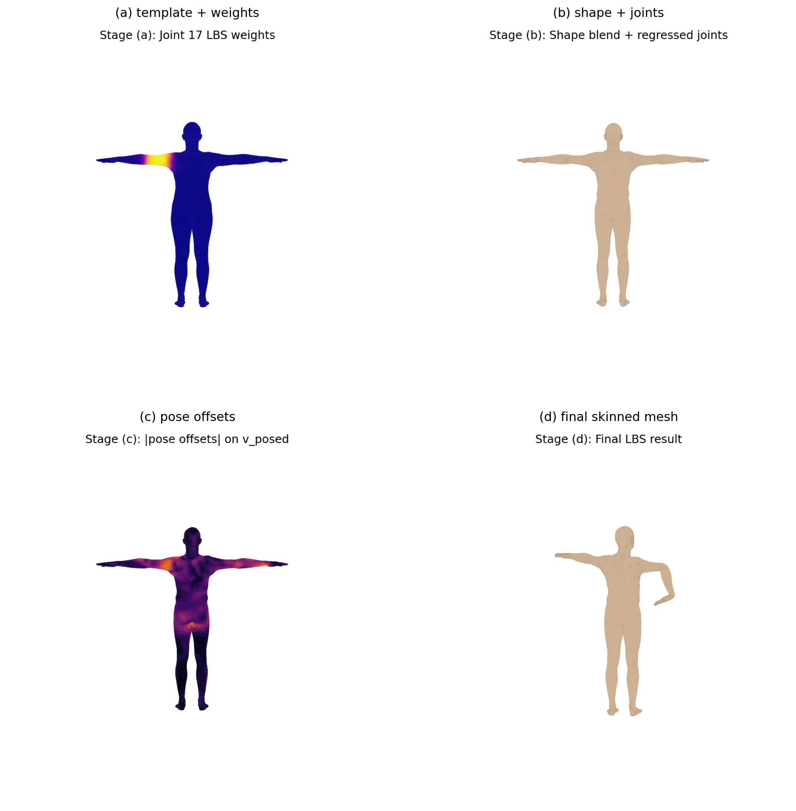

# CG_LAB

计算机图形学课程一学期实验汇总（[课程主页](https://zhanghongwen.cn/cg)）。

**学生**：武子杰 · **学号**：202411081003

---

## 课程编号对照表

| 课程编号 | 目录 | 主题 |
|----------|------|------|
| Work0 / work1 | [`work0_gravity_lab/`](work0_gravity_lab/) | Taichi 引力粒子群 |
| Week2 / work2 | [`week2_upload_package/`](week2_upload_package/) | MVP 三角形与立方体 |
| work3 | [`bezier_lab/`](bezier_lab/) | 贝塞尔曲线 |
| work4 | [`phong_lab/`](phong_lab/) | Phong 光照 |
| work5 | [`ray_tracing_lab/`](ray_tracing_lab/) | Whitted 光线追踪 |
| — | [`mass_spring_lab/`](mass_spring_lab/) | 布料仿真 v1 |
| 平台实验 | [`cloth_sim_taichi/`](cloth_sim_taichi/) | 布料仿真 v2（完整版） |
| work6_2 | [`work1_pytorch3d_lab/`](work1_pytorch3d_lab/) | PyTorch3D 可微渲染 |
| 选做 | [`smpl_lbs_lab/`](smpl_lbs_lab/) | SMPL LBS |
| 理论课 | [`theory_homework/`](theory_homework/) | 四次理论作业 |

---

## 学期概览

### 编程实验（按时间线）

1. [`work0_gravity_lab/`](work0_gravity_lab/) — Taichi GPU 引力粒子群
2. [`week2_upload_package/`](week2_upload_package/) — MVP 变换与线框渲染
3. [`bezier_lab/`](bezier_lab/) — De Casteljau 与 GPU 光栅化
4. [`phong_lab/`](phong_lab/) — Phong 光照、隐式求交、实时调参
5. [`ray_tracing_lab/`](ray_tracing_lab/) — Whitted 光线追踪
6. [`mass_spring_lab/`](mass_spring_lab/) → [`cloth_sim_taichi/`](cloth_sim_taichi/) — 质点-弹簧布料仿真（v1 → v2）
7. [`work1_pytorch3d_lab/`](work1_pytorch3d_lab/) — 可微渲染网格优化（球体 → 奶牛）

### 选做

- [`smpl_lbs_lab/`](smpl_lbs_lab/) — SMPL 线性混合蒙皮可视化

### 理论作业

- [`theory_homework/`](theory_homework/) — 基础知识 / 几何 / 渲染 / 动画，含 `.md`、`.docx`、合并 PDF

---

## 布料仿真演进

| 版本 | 目录 | 日期 | 说明 |
|------|------|------|------|
| v1 | [`mass_spring_lab/`](mass_spring_lab/) | 2026-05-21 | 初版：三种积分器、剪切/弯曲弹簧、球体碰撞、风场 |
| v2 | [`cloth_sim_taichi/`](cloth_sim_taichi/) | 2026-05-29 | 完整版：GGUI 交互、PBD 约束、benchmark 图表、GIF/MP4 导出 |

两份代码均保留；v2 为平台提交与最终报告版本。

---

## 各次作业目录

* [`work0_gravity_lab/`](work0_gravity_lab/)：Work0 Taichi 引力粒子群
* [`week2_upload_package/`](week2_upload_package/)：Week2 MVP
* [`bezier_lab/`](bezier_lab/)：贝塞尔曲线（De Casteljau + GPU 光栅化）
* [`phong_lab/`](phong_lab/)：**Phong 光照**（光线投射、隐式求交、深度竞争、`ti.ui` 滑动条）。完整报告见 **[phong_lab/README.md](phong_lab/README.md)**。
* [`ray_tracing_lab/`](ray_tracing_lab/)：**Whitted 光线追踪**（硬阴影、镜面反射、折射、MSAA）。完整报告见 **[ray_tracing_lab/README.md](ray_tracing_lab/README.md)**。
* [`mass_spring_lab/`](mass_spring_lab/)：质点-弹簧布料 v1。见 **[mass_spring_lab/README.md](mass_spring_lab/README.md)**。
* [`cloth_sim_taichi/`](cloth_sim_taichi/)：Taichi 布料仿真 v2。完整报告见 **[cloth_sim_taichi/README.md](cloth_sim_taichi/README.md)**。
* [`work1_pytorch3d_lab/`](work1_pytorch3d_lab/)：PyTorch3D 可微渲染（球体 → 奶牛）。完整报告见 **[work1_pytorch3d_lab/README.md](work1_pytorch3d_lab/README.md)**。
* [`smpl_lbs_lab/`](smpl_lbs_lab/)：SMPL LBS 可视化。完整报告见 **[smpl_lbs_lab/README.md](smpl_lbs_lab/README.md)**。
* [`theory_homework/`](theory_homework/)：理论课四次作业。见 **[theory_homework/README.md](theory_homework/README.md)**。

---

## 效果预览

### 布料仿真交互（`cloth_sim_taichi`）

### SMPL LBS 蒙皮可视化（`smpl_lbs_lab`）

### Phong 光照（`phong_lab`）

### Week2 MVP

动图路径：`week2_upload_package/assets/week2/mvp_demo.gif`（运行 `week2.make_gif` 后生成）。

---

## 目录补充说明

* `work0_gravity_lab/`：Work0 源码，`uv run -m src.Work0.main` 运行
* `week2_upload_package/week2/`：MVP 实验代码（三角形与立方体线框）
* `bezier_lab/`：贝塞尔相关代码与说明见该目录内文档
* `ray_tracing_lab/`：Whitted 光线追踪；演示 GIF 需自行录屏后放入 `assets/`
* `work1_pytorch3d_lab/`：Work1 源码、环境、实验结果与提交说明；评审与复现请以该目录为准
* `cloth_sim_taichi/`：布料仿真 v2 源码、依赖、实验报告与交互录屏
* `smpl_lbs_lab/`：SMPL LBS 源码、实验报告、可视化图与姿态动画（模型文件需自行下载）
