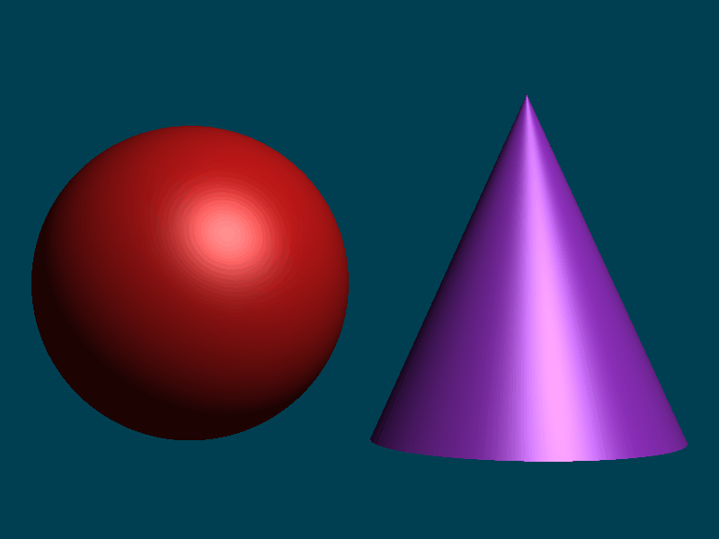

# CG_LAB

计算机图形学课程实验仓库（[课程主页](https://zhanghongwen.cn/cg)）。

## 各次作业目录

* `week2_upload_package/`：Week2 MVP
* `bezier_lab/`：贝塞尔曲线实验（Python + Taichi，De Casteljau 与 GPU 光栅化）
* `phong_lab/`：**Phong 光照模型**（Taichi 光线投射、球与圆锥隐式求交、深度竞争、`ti.ui` 滑动条实时调参）。完整说明与实验报告见 **[phong_lab/README.md](phong_lab/README.md)**。

## 效果预览

### Phong 光照（`phong_lab`）

### Week2 MVP

动图路径：`week2_upload_package/assets/week2/mvp_demo.gif`（若存在）。

## 目录补充说明

* `week2_upload_package/week2/`：MVP 实验代码（含三角形与立方体线框渲染）
* `bezier_lab/`：贝塞尔相关代码与说明见该目录内文档
