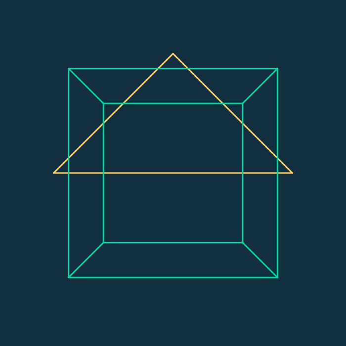

# Taichi Gravity Swarm Simulation


## 项目简介

这是一个基于 Taichi 框架实现的万有引力粒子群仿真项目，使用 GPU 并行计算来模拟大量粒子在鼠标引力场作用下的运动效果。

## 项目结构

```
CG_LAB/
├── pyproject.toml         # uv 自动生成的项目配置文件
├── src/
│   └── Work0/             # 实验零专属包
│       ├── __init__.py    # 空文件，标识这是一个 Python 包
│       ├── config.py      # 存放所有可调参数
│       ├── physics.py     # 存放 GPU 并行计算与物理逻辑
│       └── main.py        # 程序的入口文件，负责 GUI 渲染
├── .gitignore             # Git 忽略文件
├── .python-version        # Python 版本设置
└── uv.lock                # 依赖锁定文件
```

## 安装依赖

项目使用 uv 作为包管理器，安装依赖的命令如下：

```bash
# 安装 taichi 及其依赖
uv add taichi

# 同步依赖
uv sync
```

## 运行方法

在项目根目录执行以下命令：

```bash
# Week2: MVP 变换实验（本次作业）
uv run -m week2.main
```

## Week2：MVP 变换实验说明

### 实现内容

- 已实现 `get_model_matrix(angle)`：绕 `Z` 轴旋转的模型矩阵
- 已实现 `get_view_matrix(eye_pos)`：将相机位置平移到原点的视图矩阵
- 已实现 `get_projection_matrix(eye_fov, aspect_ratio, zNear, zFar)`：
  先透视到正交，再执行正交投影
- 渲染内容包含：
  - 基础要求：线框三角形
  - 选做内容：线框立方体（8 顶点、12 边）

### 交互按键

- `A`：逆时针旋转
- `D`：顺时针旋转
- `Esc`：退出程序

### 验收标准

- 程序窗口分辨率为 `700x700`
- 可看到三角形与立方体线框
- 按 `A/D` 可连续旋转
- 存在透视效果（远小近大）

### 生成 GIF（用于作业展示）

```bash
python -m week2.make_gif
```

生成文件路径：

- `assets/week2/mvp_demo.gif`

效果预览：



## 功能说明

- **粒子系统**：10000 个粒子的随机初始化
- **鼠标交互**：鼠标位置产生引力场，粒子会被吸引
- **物理模拟**：包含引力、阻力和边界碰撞
- **GPU 加速**：使用 Taichi 框架进行并行计算
- **实时渲染**：实时显示粒子运动效果

## 参数配置

可以在 `src/Work0/config.py` 文件中调整以下参数：

- `NUM_PARTICLES`：粒子总数（卡顿请调小此数值，如 2000）
- `GRAVITY_STRENGTH`：鼠标引力强度
- `DRAG_COEF`：空气阻力系数
- `BOUNCE_COEF`：边界反弹能量损耗
- `WINDOW_RES`：窗口分辨率
- `PARTICLE_RADIUS`：粒子绘制半径
- `PARTICLE_COLOR`：粒子颜色

## 效果展示

### 交互效果

当您运行程序后，会弹出一个窗口，移动鼠标可以观察到粒子群被鼠标吸引的效果。粒子会根据鼠标位置产生引力，同时受到空气阻力的影响，并在边界处发生反弹。

### 技术特点

- **GPU 并行计算**：使用 Taichi 框架实现 GPU 加速，能够高效处理大量粒子的计算
- **模块化设计**：代码结构清晰，分为配置、物理逻辑和渲染三个模块
- **现代 Python 布局**：采用 src 布局结构，使用 Module 运行模式，避免路径问题

## 依赖项

- taichi==1.7.4
- numpy==2.4.2
- rich==14.3.3
- colorama==0.4.6
- dill==0.4.1

## 开发环境

- Python 3.12
- Taichi 1.7.4
- uv 0.10.8

## 注意事项

- 如需调整粒子数量以获得更好的性能，请修改 `config.py` 中的 `NUM_PARTICLES` 参数
- 程序首次运行时会编译 GPU 内核，可能需要稍等片刻
- 运行过程中移动鼠标可以观察到粒子群的动态效果
