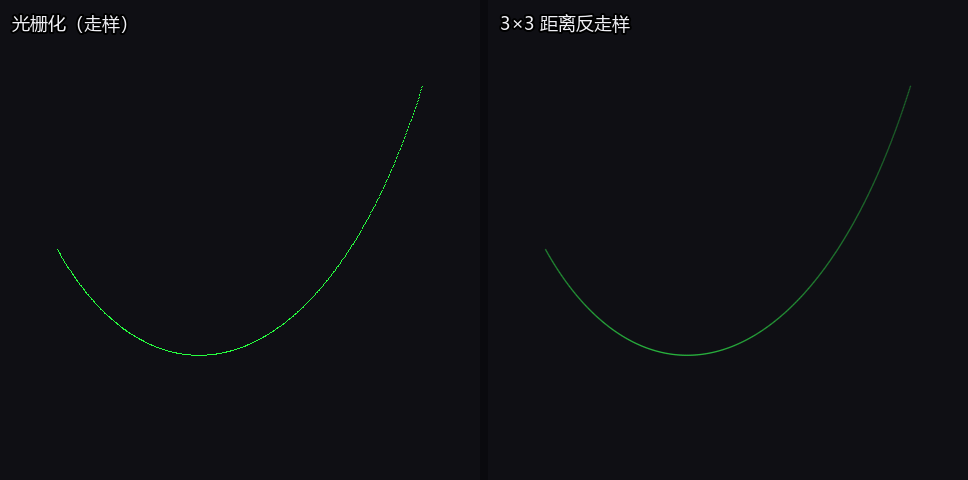
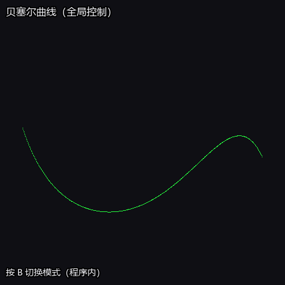

# 贝塞尔曲线实验（Python + Taichi）

- **授课教师**：张鸿文  
- **助教**：张怡冉  
- **课程主页**：https://zhanghongwen.cn/cg  

## 动图演示


动图由仓库内 [`export_demo_gif.py`](export_demo_gif.py) 生成（需 `pip install pillow`）。

## 选做功能演示（动图）

程序内已支持：**A** 开关 **3×3 邻域距离反走样**，**B** 在 **贝塞尔** 与 **均匀三次 B 样条** 之间切换（控制点不少于 4 个时 B 样条按 **n−3** 段拼接；不足 4 点时仍按贝塞尔方式采样，避免空曲线）。

| 选做 | 说明 |
|------|------|
| 反走样 | 亚像素点到像素中心距离衰减，多像素混合减轻锯齿 |
| B 样条 | 均匀三次 B 样条基函数混合，便于观察局部控制与全局贝塞尔之差异 |





上述两图由 [`export_optional_gifs.py`](export_optional_gifs.py) 生成，运行前请安装 Pillow：`pip install pillow`，在 `bezier_lab` 目录执行 `python export_optional_gifs.py`。

## 静态参考效果图

（与实验说明中的参考效果一致；因飞书文档常无法外链展示，此处用脚本按同一视觉规范绘制。）


生成方式：`pip install pillow` 后执行 `python export_reference_figure.py`，输出 `assets/reference_effect.png`。

## 内容说明

使用 De Casteljau 算法在 CPU 端采样贝塞尔曲线，将采样点批量传入 GPU，通过 `@ti.kernel` 并行完成光栅化（点亮 `pixels` 帧缓冲）。控制点通过 GGUI 绘制，支持控制多边形（灰线）与曲线（绿色）叠加显示。

## 环境

- Python 3.8+（推荐 3.10+）
- Windows / Linux / macOS，需支持 Taichi 所选后端（GPU 不可用时自动回退 CPU）

## 安装与运行

```bash
pip install -r requirements.txt
python bezier_taichi.py
```

## 交互

| 操作 | 说明 |
|------|------|
| **鼠标左键** | 在画布上添加控制点（红色圆点） |
| **键盘 C** | 清空所有控制点并重置画面 |
| **键盘 A** | 开关反走样（关：GPU 单像素光栅；开：CPU 批量 3×3 距离衰减写入帧缓冲） |
| **键盘 B** | 在贝塞尔模式与均匀三次 B 样条模式之间切换 |

当控制点不少于 2 个时，自动用灰色折线连接控制点（控制多边形），并实时绘制绿色曲线（模式由 **B** 决定）。

## 参数（与实验要求一致）

- 画布分辨率：800×800  
- 曲线采样段数：`NUM_SEGMENTS = 1000`（共 1001 个采样点）  
- 最大控制点数：100  
