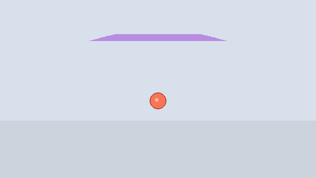
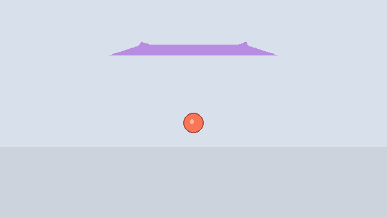
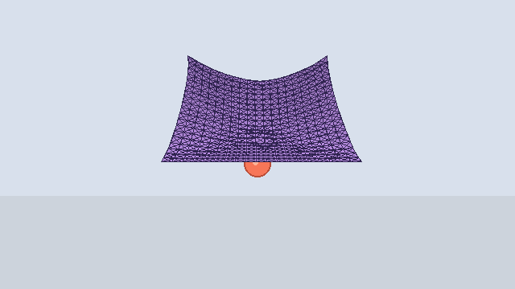
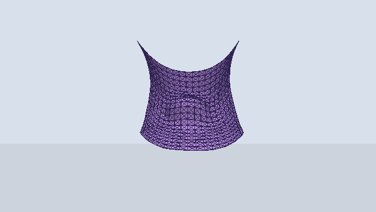
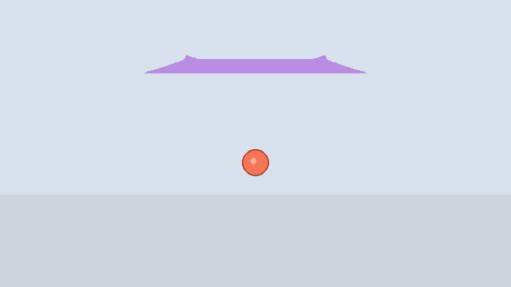
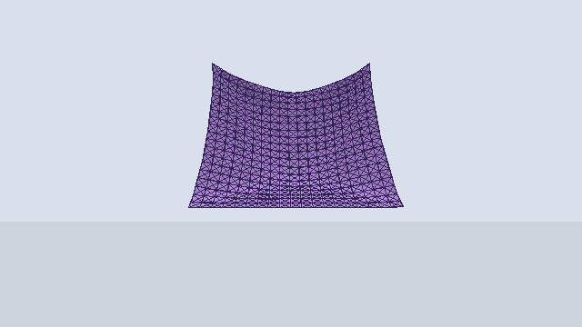

# Taichi 布料仿真实验报告（V2 强化版：更真实展示）

## 1. 实验信息

- 实验主题：基于 Taichi 的质点-弹簧布料仿真
- 实现内容：必做 + 选做全部完成，并完成 V2 真实感升级
- 代码目录：`cloth_sim_taichi/`
- 运行环境：Python 3.13，Taichi 1.7.4（已在本项目中验证）

---

## 2. 实验目标对应完成情况

### 2.1 动态场景渲染（已完成）
- 使用 `taichi.ui.Window` 构建 3D 场景。
- 使用 GGUI 面板实现参数实时调节、积分器切换、暂停、重置。
- 布料使用三角网格渲染，同时叠加弹簧线框。

### 2.2 质点-弹簧模型（已完成）
- 实现重力、阻尼、弹簧弹力（结构/剪切/弯曲）。
- 并行累加弹簧力时使用 `ti.atomic_add` 避免写冲突。
- 提供 `clamp_velocity()` 速度钳制，抑制数值爆炸。

### 2.3 三种数值积分（已完成）
- 显式欧拉：`step_explicit()`
- 半隐式欧拉：`step_semi_implicit()`
- 隐式欧拉（定点迭代近似）：`step_implicit_iter()`
- 支持运行时一键切换，便于稳定性对比。

### 2.4 GPU 编程基础（已完成）
- 初始化拆分为多个 Kernel（粒子、弹簧、渲染索引）并顺序调用，保证状态同步。
- 力计算与防爆函数写为 `@ti.func`，编译期内联，减少调用开销。
- 每个积分方法将受力与积分合并到单个 step kernel 中，减少每帧 kernel 启动次数。

### 2.5 选做内容（已完成）
- 增加剪切弹簧（Shear）与弯曲弹簧（Bending）。
- 增加球体碰撞（投影修正 + 法向速度反射/衰减）。

### 2.6 真实感升级（新增）
- 增加弹簧速度阻尼、空气阻力、动态风场（时间变化）。
- 增加 PBD 风格约束投影（Constraint Projection），显著提升布料形态稳定性。
- 碰撞加入摩擦与地面碰撞，减少“橡皮弹跳”感。
- 导出脚本升级为离线面片着色渲染，输出 MP4 + GIF。

---

## 3. 项目结构

```text
cloth_sim_taichi/
├─ config.py              # 参数配置、求解器常量
├─ simulation.py          # 物理系统核心（质点/弹簧/积分/碰撞）
├─ main.py                # 交互式 GGUI 主程序
├─ export_gifs.py         # 批量导出对比动图（MP4 + GIF）
├─ requirements.txt       # 依赖
├─ assets/               # 交互录屏与展示素材
└─ outputs/
   ├─ gifs/               # GIF 展示（运行 export_gifs.py 后生成）
   └─ mp4/                # 高质量 MP4
```

---

## 4. 实验原理

### 4.1 质点-弹簧模型

布料离散为网格质点。相邻质点由弹簧连接。

- 胡克定律（弹力）：

$$
\mathbf{f}_{a} = -k_s \left(\|\mathbf{x}_a - \mathbf{x}_b\| - l\right)
\frac{\mathbf{x}_a - \mathbf{x}_b}{\|\mathbf{x}_a - \mathbf{x}_b\|}
$$

- 阻尼力：

$$
\mathbf{f}_d = -k_d \mathbf{v}
$$

- 运动方程：

$$
\mathbf{a} = \frac{\mathbf{F}}{m}
$$

---

### 4.2 三种积分方法

- 显式欧拉（Explicit Euler）
  - $x_{t+1} = x_t + v_t \Delta t$
  - $v_{t+1} = v_t + a_t \Delta t$
- 半隐式欧拉（Semi-Implicit Euler）
  - $v_{t+1} = v_t + a_t \Delta t$
  - $x_{t+1} = x_t + v_{t+1} \Delta t$
- 隐式欧拉（定点迭代近似）
  - 迭代逼近未来状态受力 $a_{t+1}$，提高稳定性

---

## 5. 关键实现说明

## 5.1 初始化拆分（多 Kernel）

在 `simulation.py` 中将初始化分为：
- `init_particles_kernel()`：位置、速度、固定点、质量初始化
- `init_spring_kernel()`：弹簧数据合法化
- `init_triangle_indices_kernel()`：三角形渲染索引
- `init_line_indices_kernel()`：弹簧线框索引

Python 端按顺序调用 `initialize_scene()`，避免并发状态不一致。

## 5.2 并行力累加与 ti.func 内联

- `compute_forces_on()` / `compute_forces_on_pred()` 计算重力、空气阻力、风场相对速度阻尼
- 弹簧项在 spring 循环中用 `ti.atomic_add` 分量级累加
- `clamp_velocity()` 作为 `@ti.func` 在编译期内联

## 5.3 稳定性增强（V2）

- `project_constraints()`：在每次积分后做弹簧长度约束投影，抑制数值漂移
- `update_velocity_from_position()`：由位置差分回写速度，保持速度与约束后位置一致
- `resolve_collision()`：球体 + 地面统一碰撞，并加入摩擦项

## 5.4 三种积分器对应实现

- `step_explicit()`：位置用旧速度更新
- `step_semi_implicit()`：先更新速度，再更新位置
- `step_implicit_iter()`：维护 `x_pred / v_pred`，做多轮定点迭代后回写

## 5.5 选做功能实现

- 剪切弹簧：网格对角线连接
- 弯曲弹簧：跨一个点连接（2-hop）
- 球体碰撞：
  1. 若质点进入球内，沿法线投影到球面外
  2. 法向入射速度反弹并乘恢复系数

---

## 6. GGUI 交互功能

运行 `main.py` 后，可在面板中：

- 一键切换积分器（显式 / 半隐式 / 隐式）
- 暂停/继续
- 重置布料
- 滑条调参：阻尼、弹簧阻尼、空气阻力、刚度、约束迭代、约束强度、dt、substeps、最大速度、隐式迭代、球半径、恢复系数、摩擦、地面高度、风强度、风频率
- 复选框开关：剪切弹簧、弯曲弹簧、球碰撞、线框显示、相机自动环绕

---

## 7. 动图结果展示

> 所有展示动图已放入 `assets/` 并使用英文文件名，便于 GitHub 直接预览。  
> 交互录屏原文件约 64MB，仓库内提供压缩版 `interactive_demo_20260521.gif`（约 10MB）。

### 7.0 交互演示（GGUI 实时录屏）

本段为运行 `main.py` 后，在 Taichi GGUI 中实时切换积分器、调节参数并观察布料与球体碰撞的录屏效果。


### 7.1 三种积分器在 damping=1.0

- Explicit Euler  


- Semi-Implicit Euler  


- Implicit Euler  


### 7.2 三种积分器在 damping=5.0

- Explicit Euler  


- Semi-Implicit Euler  


- Implicit Euler  


### 7.3 选做效果对比

- 无剪切/弯曲 vs 有剪切/弯曲  
  


- 无碰撞 vs 有球碰撞  
  


---

## 8. 结果分析与结论

### 8.1 稳定性对比结论

- 显式欧拉：在高刚度、较大 `dt` 或低阻尼时最容易出现震荡放大，依赖较严格的速度钳制与小时间步。
- 半隐式欧拉：稳定性明显优于显式欧拉，能在相同参数下保持更自然的衰减。
- 隐式欧拉（定点迭代）：最稳定，允许更大的时间步和刚度；代价是计算量增加、细节可能更“粘”。

### 8.2 阻尼参数影响

- `damping=1.0`：布料振动幅度较大，动态更明显。
- `damping=5.0`：振动衰减更快，系统更平稳但“柔软感”下降。

### 8.3 选做模块影响

- 增加剪切 + 弯曲后，布料抗扭曲与抗折能力提升，形态更接近真实织物。
- 增加球碰撞后，布料可与障碍体形成自然搭接与滑动，不再穿透。

---

## 9. 复现实验步骤

在项目根目录执行：

```bash
pip install -r cloth_sim_taichi/requirements.txt
python cloth_sim_taichi/main.py
```

导出对比 GIF + MP4：

```bash
python cloth_sim_taichi/export_gifs.py
```

快速导出（更少帧，便于调试）：

```bash
python cloth_sim_taichi/export_gifs.py --frame-count 40 --warmup 5 --stride 4 --fps 20 --width 640 --height 360
```

关闭线框，导出更接近视频展示风格：

```bash
python cloth_sim_taichi/export_gifs.py --no-wireframe
```

---

## 10. 实验中的工程优化点

- 使用 `@ti.func` 内联力学计算，降低函数调用开销。
- 每个积分器将受力与积分合并为单 kernel，减少每帧 kernel 启动次数。
- 初始化阶段拆多 kernel 串行执行，避免复杂状态耦合。
- 导出脚本采用 CPU 仿真 + 离线面片着色渲染，稳定生成更真实的演示视频。
- 同时输出 MP4 与 GIF，便于课程提交和社交平台展示。

---

## 11. 可继续提升的方向

- 隐式积分从定点迭代升级到牛顿迭代 / 共轭梯度求解。
- 加入自碰撞（cloth self-collision）和摩擦模型。
- 使用 XPBD / Position Based Dynamics 进行更鲁棒的大步长模拟。
- 增加风场、纹理渲染和多光源，提升展示效果。

---

## 12. 对照提交清单

- [x] 场景初始化（多 kernel）
- [x] 力计算 + 防爆（`ti.func` + `ti.atomic_add`）
- [x] 三种积分器（核心）
- [x] GGUI 交互切换
- [x] 选做：剪切/弯曲弹簧
- [x] 选做：球体碰撞
- [x] 动图导出脚本
- [x] 详细实验报告（本文件）
