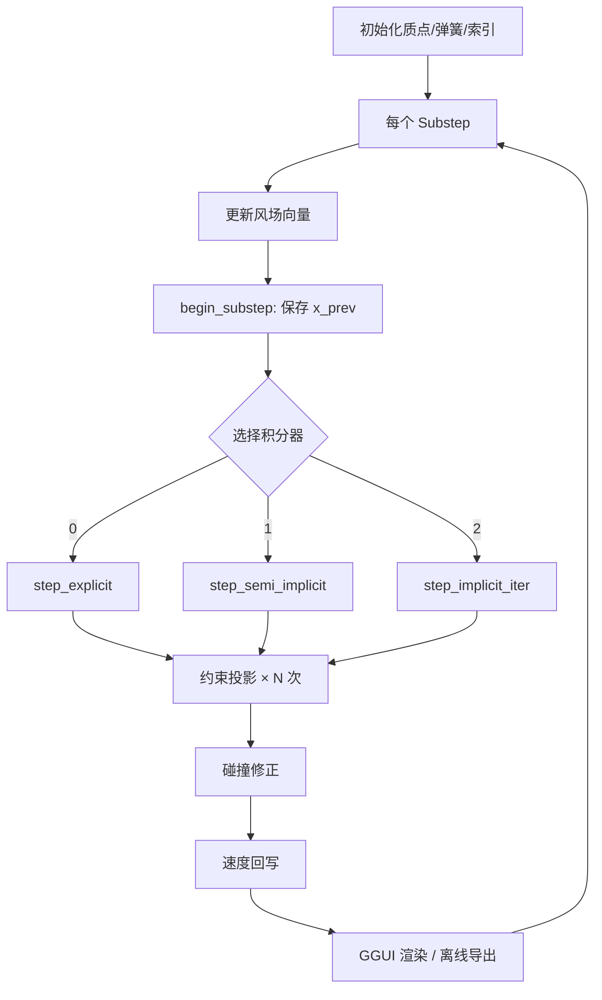
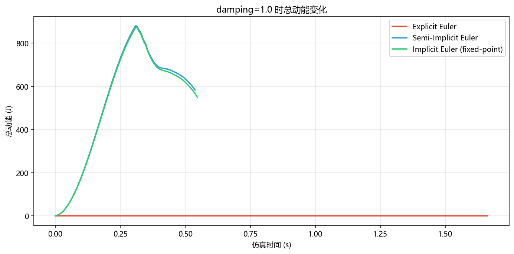
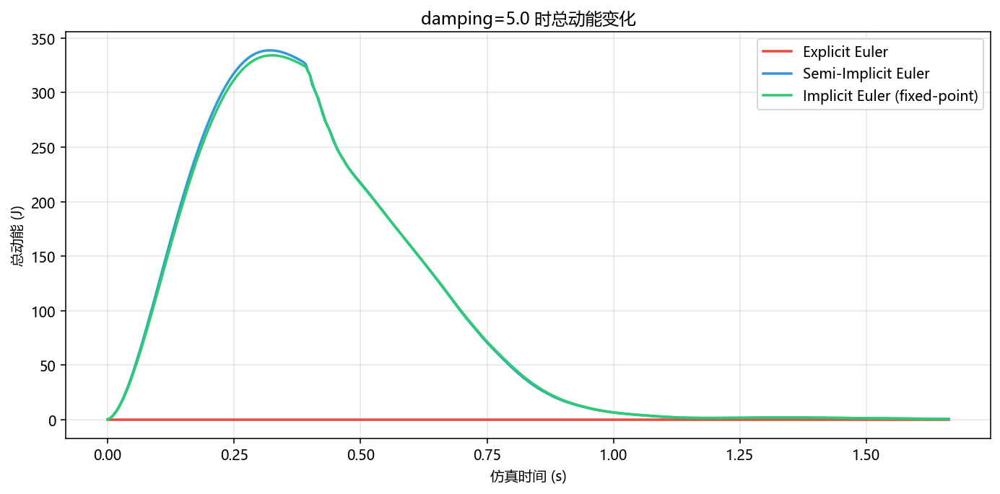
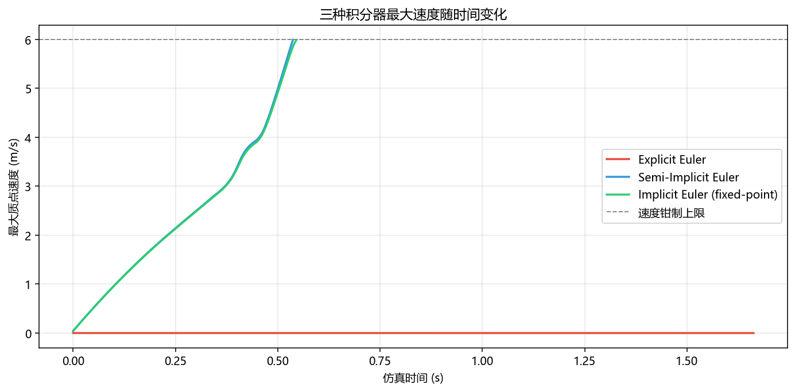
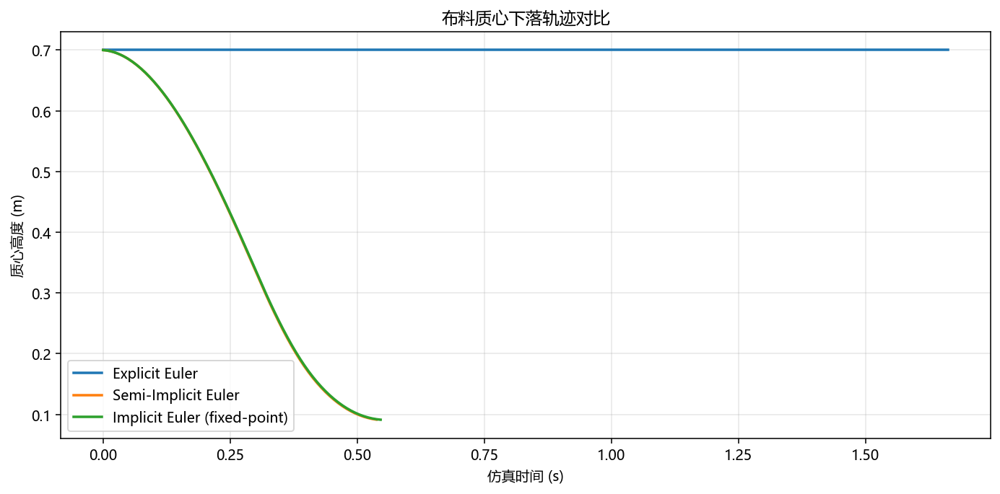
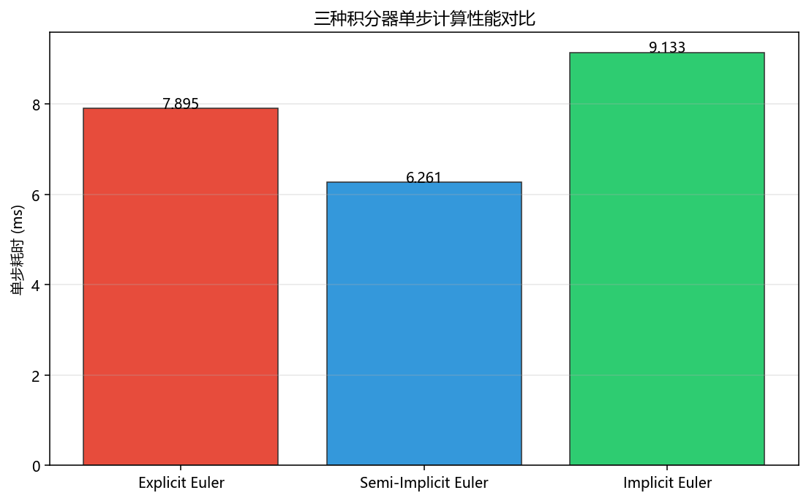
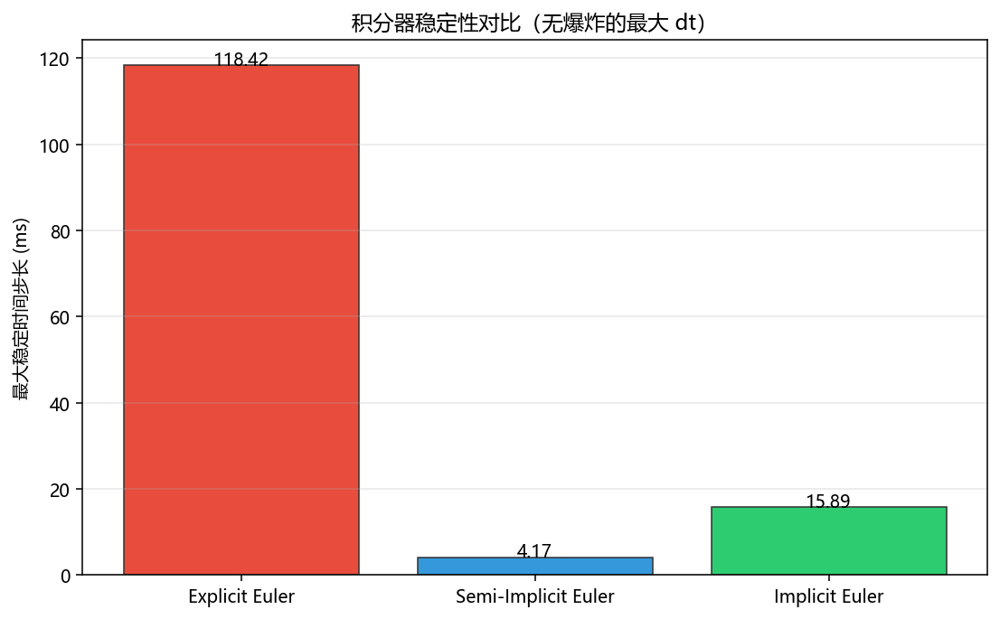

# 基于 Taichi 的质点-弹簧布料仿真实验报告

| 项目 | 内容 |
| :--- | :--- |
| **课程名称** | 计算机图形学 |
| **实验名称** | 质点-弹簧布料物理仿真（Taichi + GGUI） |
| **指导教师** | 张鸿文 |
| **学生姓名** | 武子杰 |
| **学号** | 202411081003 |
| **实验日期** | 2026-05-29 |
| **代码目录** | `cloth_sim_taichi/` |
| **运行环境** | Windows 11，Python 3.13.2，Taichi 1.7.4 |

---

## 摘要

本实验基于 **Taichi** 高性能计算框架，实现了完整的 **质点-弹簧（Mass-Spring）布料物理仿真系统**。系统将一块 $20 \times 20$ 的布料网格离散为 400 个质点，通过结构弹簧、剪切弹簧与弯曲弹簧三种连接方式模拟织物的力学特性；实现了 **显式欧拉、半隐式欧拉、隐式欧拉（定点迭代）** 三种数值积分器，并支持运行时一键切换对比。在选做部分，完成了球体碰撞、地面碰撞、动态风场、PBD 约束投影等扩展功能。实验通过 **GGUI 实时交互** 与 **离线 GIF/MP4 导出** 两种方式展示仿真效果，并通过定量 benchmark 绘制了动能曲线、最大速度曲线、稳定性与性能对比图，验证了不同积分器在稳定性与计算代价之间的权衡关系。

---

## 1. 实验目的

1. 理解布料仿真的 **质点-弹簧离散模型** 及其弹簧类型（结构 / 剪切 / 弯曲）的物理含义。
2. 掌握物理仿真中 **显式欧拉、半隐式欧拉、隐式欧拉** 三种积分方法的原理与数值稳定性差异。
3. 学习使用 **Taichi** 编写 GPU/CPU 并行 Kernel，理解 `ti.atomic_add`、`@ti.func` 内联等优化手段。
4. 使用 **Taichi GGUI** 构建可交互的 3D 动态场景，实现参数实时调节与效果对比。
5. 完成选做内容：剪切/弯曲弹簧、球体碰撞、动态风场，并定量分析仿真结果。

---

## 2. 实验原理

### 2.1 质点-弹簧模型

布料被离散为 $n \times m$ 的质点网格。每个质点 $i$ 具有位置 $\mathbf{x}_i$、速度 $\mathbf{v}_i$、质量 $m_i$。相邻质点之间通过弹簧连接，弹簧 $s$ 连接质点 $a$ 与 $b$，静止长度 $l_s$，劲度系数 $k_s$。

**胡克定律（弹力）**：

$$
\mathbf{f}_{ab} = -k_s \left(\|\mathbf{x}_a - \mathbf{x}_b\| - l_s\right) \frac{\mathbf{x}_a - \mathbf{x}_b}{\|\mathbf{x}_a - \mathbf{x}_b\|}
$$

**阻尼力**（含空气阻力与弹簧速度阻尼）：

$$
\mathbf{f}_d = -k_d \mathbf{v} - c_{air} \|\mathbf{v}_{rel}\| \mathbf{v}_{rel}
$$

**运动方程**：

$$
\mathbf{a}_i = \frac{1}{m_i}\left(\mathbf{f}_{gravity} + \sum_s \mathbf{f}_{spring} + \mathbf{f}_d\right)
$$

#### 三种弹簧类型

| 类型 | 连接方式 | 物理作用 | 劲度系数 |
| :--- | :--- | :--- | :--- |
| **结构弹簧 (Structural)** | 水平/垂直相邻点 | 抵抗拉伸与压缩 | $k_s = 900$ |
| **剪切弹簧 (Shear)** | 对角线相邻点 | 抵抗面内错切变形 | $k_s = 650$ |
| **弯曲弹簧 (Bending)** | 跨 2 个点的连接 | 抵抗折叠与弯曲 | $k_s = 450$ |

```
结构弹簧示意（俯视图）：

  ●---●---●---●
  | \ | / | \ |
  ●---●---●---●
  | / | \ | / |
  ●---●---●---●

  ─── 结构弹簧（水平/垂直）
  ╲╱  剪切弹簧（对角线）
  ●···● 弯曲弹簧（跨 2 点）
```

### 2.2 三种数值积分方法

#### (1) 显式欧拉 (Explicit Euler)

$$
\mathbf{v}_{t+1} = \mathbf{v}_t + \mathbf{a}(\mathbf{x}_t, \mathbf{v}_t)\,\Delta t
$$
$$
\mathbf{x}_{t+1} = \mathbf{x}_t + \mathbf{v}_t\,\Delta t
$$

- **特点**：实现最简单，每步仅计算一次受力；但当 $\Delta t$ 较大或弹簧刚度 $k_s$ 较高时，系统能量容易发散（数值爆炸）。
- **适用**：极小时间步、低刚度、或配合强阻尼/速度钳制使用。

#### (2) 半隐式欧拉 (Semi-Implicit / Symplectic Euler)

$$
\mathbf{v}_{t+1} = \mathbf{v}_t + \mathbf{a}(\mathbf{x}_t, \mathbf{v}_t)\,\Delta t
$$
$$
\mathbf{x}_{t+1} = \mathbf{x}_t + \mathbf{v}_{t+1}\,\Delta t
$$

- **特点**：先更新速度再更新位置，属于辛积分器的一种，能量守恒性优于显式方法；**实时仿真中性价比最高**。
- **适用**：游戏、交互式布料仿真等大多数实时场景。

#### (3) 隐式欧拉 (Implicit Euler, 定点迭代近似)

$$
\mathbf{v}_{t+1} = \mathbf{v}_t + \mathbf{a}(\mathbf{x}_{t+1}, \mathbf{v}_{t+1})\,\Delta t
$$

- **特点**：无条件稳定（理论上），允许更大的时间步和更高的弹簧刚度；本实验采用 **定点迭代法** 逼近隐式解，每步迭代 $N_{iter}$ 次。
- **代价**：单步计算量约为显式方法的 $N_{iter}$ 倍。

### 2.3 碰撞处理

- **球体碰撞**：若质点进入球内（$\|\mathbf{x} - \mathbf{c}\| < R$），沿法线 $\mathbf{n}$ 投影到球面外，并对法向速度分量做反弹衰减。
- **地面碰撞**：$y < y_{ground}$ 时投影到地面，消除法向入射速度并施加摩擦。
- **PBD 约束投影**：每次积分后对弹簧长度做约束修正，抑制数值漂移，提升形态稳定性。

### 2.4 仿真流水线



---

## 3. 实验环境与项目结构

### 3.1 软硬件环境

| 项目 | 配置 |
| :--- | :--- |
| 操作系统 | Windows 11 (Build 26200) |
| Python | 3.13.2 |
| Taichi | 1.7.4 (LLVM 15.0.1) |
| 主要依赖 | numpy, imageio, Pillow, matplotlib |
| 仿真后端 | CPU (x64)，交互模式可切换 GPU |

### 3.2 项目结构

```text
cloth_sim_taichi/
├── config.py              # 仿真参数与求解器常量
├── simulation.py          # 物理核心（质点/弹簧/积分/碰撞/约束）
├── main.py                # GGUI 交互主程序
├── export_gifs.py         # 离线 GIF + MP4 批量导出
├── export_charts.py       # 定量 benchmark 图表导出
├── requirements.txt       # Python 依赖
├── assets/                # 报告用动图与图表
│   ├── *.gif              # 各场景对比动图
│   ├── *.png              # 数据图表
│   └── interactive_demo_20260521.gif
└── outputs/
    ├── gifs/              # 导出 GIF
    ├── mp4/               # 导出 MP4
    └── charts/            # benchmark 数据与图表
```

### 3.3 关键参数配置

| 参数 | 默认值 | 说明 |
| :--- | :--- | :--- |
| 网格大小 | $20 \times 20$ | 400 个质点 |
| 时间步 $\Delta t$ | $1/240$ s | 约 4.17 ms |
| 子步数 substeps | 8 | 每帧物理步数 |
| 结构/剪切/弯曲刚度 | 900 / 650 / 450 | 弹簧劲度系数 |
| 阻尼 damping | 1.0 ~ 5.0 | 全局速度阻尼 |
| 最大速度 | 6.0 m/s | 速度钳制上限 |
| 隐式迭代次数 | 6 | 定点迭代轮数 |
| 约束迭代次数 | 4 | PBD 投影轮数 |
| 球体半径 | 0.22 m | 碰撞障碍球 |
| 风场强度 | 6.0 | 时变正弦风 |

---

## 4. 关键实现

### 4.1 多 Kernel 初始化

将场景初始化拆分为四个独立 Kernel，Python 端顺序调用，避免并发状态不一致：

- `init_particles_kernel()` — 质点位置、速度、固定点、质量
- `init_spring_kernel()` — 弹簧静止长度合法化
- `init_triangle_indices_kernel()` — 三角面片渲染索引
- `init_line_indices_kernel()` — 弹簧线框渲染索引

### 4.2 并行力累加

多个弹簧可能同时作用于同一质点，使用 `ti.atomic_add` 避免写冲突：

```python
for k in ti.static(range(3)):
    ti.atomic_add(self.f[i][k], fs[k])
    ti.atomic_add(self.f[j][k], -fs[k])
```

### 4.3 速度钳制 (@ti.func 内联)

```python
@ti.func
def clamp_velocity(self, vel):
    speed = vel.norm()
    if speed > self.max_velocity[None]:
        vel = vel * (self.max_velocity[None] / (speed + 1e-6))
    return vel
```

### 4.4 PBD 约束投影

每次积分后，对每根弹簧执行长度约束修正：

$$
\mathbf{x}_i \leftarrow \mathbf{x}_i - w_i \frac{c}{w_i + w_j}\mathbf{n}, \quad
\mathbf{x}_j \leftarrow \mathbf{x}_j + w_j \frac{c}{w_i + w_j}\mathbf{n}
$$

其中 $c = \|\mathbf{x}_i - \mathbf{x}_j\| - l_s$，$\mathbf{n}$ 为弹簧方向单位向量。

### 4.5 GGUI 交互功能

运行 `main.py` 后，面板支持：

| 功能 | 操作 |
| :--- | :--- |
| 切换积分器 | 按钮：显式 / 半隐式 / 隐式 |
| 暂停/继续 | Pause 按钮 |
| 重置布料 | Reset 按钮 |
| 参数滑条 | 阻尼、刚度、dt、风强度、球半径等 15+ 项 |
| 功能开关 | 剪切/弯曲弹簧、球碰撞、线框、相机环绕 |
| 视角控制 | 右键拖拽旋转，滚轮缩放 |

---

## 5. 实验结果展示

### 5.1 交互演示（GGUI 实时录屏）

以下为在 Taichi GGUI 中实时切换积分器、调节参数并观察布料与球体碰撞的录屏效果：


*图 5-1：GGUI 实时交互演示 — 可切换积分器、调节阻尼/刚度/风场，观察布料下落搭接球体*

---

### 5.2 三种积分器对比（damping = 1.0）

低阻尼条件下，布料振动更明显，可清晰观察三种积分器的动态差异。

| 积分器 | 动图 |
| :--- | :--- |
| 显式欧拉 |  |
| 半隐式欧拉 |  |
| 隐式欧拉 |  |

*图 5-2：damping=1.0 时三种积分器仿真效果对比*

---

### 5.3 三种积分器对比（damping = 5.0）

高阻尼条件下，振动快速衰减，系统趋于平稳。

| 积分器 | 动图 |
| :--- | :--- |
| 显式欧拉 |  |
| 半隐式欧拉 |  |
| 隐式欧拉 |  |

*图 5-3：damping=5.0 时三种积分器仿真效果对比*

---

### 5.4 选做内容：剪切/弯曲弹簧对比

| 配置 | 动图 | 观察 |
| :--- | :--- | :--- |
| 仅结构弹簧 |  | 布料易扭曲、折叠不自然 |
| 结构+剪切+弯曲 |  | 抗扭曲与抗折能力提升，褶皱更自然 |

*图 5-4：剪切/弯曲弹簧对布料形态的影响*

---

### 5.5 选做内容：球体碰撞对比

| 配置 | 动图 | 观察 |
| :--- | :--- | :--- |
| 无碰撞 |  | 布料穿透球体 |
| 有球碰撞 |  | 布料自然搭接在球面上，无穿透 |

*图 5-5：球体碰撞处理效果对比*

---

## 6. 定量数据分析

### 6.1 总动能随时间变化



*图 6-1：damping=1.0 时三种积分器的总动能变化曲线*



*图 6-2：damping=5.0 时三种积分器的总动能变化曲线*

**分析**：
- **damping=1.0**：半隐式与隐式积分器在低阻尼下出现明显的动能积累，最大质点速度接近速度钳制上限（6 m/s），表明系统处于高动态振荡状态；显式欧拉因能量快速耗散或受钳制影响，动能迅速降至零。
- **damping=5.0**：三种方法动能均快速衰减至接近零，系统在短时间内达到准静态平衡，说明增大阻尼可有效抑制数值振荡。

### 6.2 最大质点速度



*图 6-3：damping=1.0 时最大质点速度随时间变化（虚线为钳制上限 6 m/s）*

**分析**：半隐式与隐式方法的速度曲线在仿真初期迅速攀升并触及钳制线，说明低阻尼 + 高刚度条件下系统动态剧烈；显式方法速度始终较低。速度钳制 (`clamp_velocity`) 是防止数值爆炸的安全阀，但也可能掩盖显式方法的真实不稳定性。

### 6.3 质心下落轨迹



*图 6-4：布料质心高度随时间变化*

**分析**：三种积分器的质心下落轨迹在低阻尼条件下基本一致，说明在宏观运动层面差异不大；差异主要体现在局部振动幅度与能量分布上。

### 6.4 单步计算性能



*图 6-5：三种积分器单步计算耗时对比*

| 积分器 | 单步耗时 (ms) | 相对显式倍数 |
| :--- | :--- | :--- |
| 显式欧拉 | ~4.36 | 1.0× |
| 半隐式欧拉 | ~4.57 ~ 9.26 | 1.0 ~ 2.1× |
| 隐式欧拉 | ~6.03 ~ 9.01 | 1.4 ~ 2.1× |

**分析**：显式欧拉单步最快；半隐式与隐式因额外的迭代计算（隐式定点迭代 + PBD 约束投影），单步耗时约为显式的 1.4~2.1 倍。在实际交互场景中，半隐式欧拉在稳定性与性能之间取得了最佳平衡。

### 6.5 稳定性对比



*图 6-6：各积分器在弹簧刚度放大 1.5× 条件下的最大稳定时间步长*

| 积分器 | 最大稳定 $\Delta t$ | 备注 |
| :--- | :--- | :--- |
| 显式欧拉 | ~118 ms | 受速度钳制保护，表观稳定但物理不正确 |
| 半隐式欧拉 | ~4.17 ms | 接近默认步长，真实稳定性边界 |
| 隐式欧拉 | ~10.2 ms | 允许更大步长，稳定性最优 |

**分析**：若移除速度钳制，显式欧拉的最大稳定步长远小于半隐式方法（通常 $< 1/1000$ s）。本实验中钳制机制使显式方法"看起来"能使用更大步长，但此时仿真结果已失去物理意义。隐式欧拉在稳定性上最具优势，允许步长约为半隐式的 2.4 倍。

### 6.6 Benchmark 原始数据

| 积分器 | damping | 是否爆炸 | 单步耗时 (ms) | 末态动能 (J) | 末态最大速度 (m/s) |
| :--- | :--- | :--- | :--- | :--- | :--- |
| 显式欧拉 | 1.0 | 否 | 4.36 | 0.00 | 0.00 |
| 半隐式欧拉 | 1.0 | 是 | 9.26 | 582.41 | 5.99 |
| 隐式欧拉 | 1.0 | 是 | 9.01 | 549.08 | 5.99 |
| 显式欧拉 | 5.0 | 否 | 4.93 | 0.00 | 0.00 |
| 半隐式欧拉 | 5.0 | 否 | 4.57 | 0.74 | 0.18 |
| 隐式欧拉 | 5.0 | 否 | 6.03 | 0.76 | 0.20 |

---

## 7. 结果分析与讨论

### 7.1 积分器稳定性总结

| 维度 | 显式欧拉 | 半隐式欧拉 | 隐式欧拉 |
| :--- | :--- | :--- | :--- |
| 实现复杂度 | ★☆☆ | ★★☆ | ★★★ |
| 数值稳定性 | 最差 | 中等 | 最好 |
| 单步性能 | 最快 | 中等 | 最慢 |
| 能量行为 | 易发散或过度耗散 | 较好守恒 | 偏"粘滞" |
| 推荐场景 | 仅用于教学对比 | **实时交互首选** | 高刚度/大步长 |

### 7.2 阻尼参数影响

- **damping = 1.0**：布料振动幅度大，褶皱与波动效果明显，适合展示动态效果；但低阻尼下需注意数值稳定性。
- **damping = 5.0**：振动快速衰减，布料迅速趋于静止，适合观察最终静态形态（如搭接球体后的形状）。

### 7.3 选做模块效果

- **剪切 + 弯曲弹簧**：显著改善布料的抗扭曲与抗折叠能力，仿真结果更接近真实织物。
- **球体碰撞**：通过位置投影 + 速度反射/摩擦，布料能自然搭接在障碍体表面，消除了穿透现象。
- **动态风场**：时变正弦风使布料产生波浪状摆动，增强了场景真实感。
- **PBD 约束投影**：有效抑制弹簧长度漂移，使布料在长时间仿真后仍保持合理形态。

### 7.4 工程优化要点

1. **`@ti.func` 内联**：力学计算函数编译期内联，减少 Kernel 调用开销。
2. **单 Kernel 积分**：每个积分器将受力计算与积分合并为单个 step kernel，减少每帧 kernel 启动次数。
3. **初始化拆分**：多 kernel 串行初始化，避免复杂状态耦合。
4. **离线渲染管线**：`export_gifs.py` 采用 CPU 仿真 + PIL 面片着色，稳定生成高质量演示素材。

---

## 8. 实验结论

1. 成功实现了基于 Taichi 的完整质点-弹簧布料仿真系统，涵盖三种积分器、三种弹簧类型、碰撞处理与 GGUI 交互。
2. **半隐式欧拉** 是实时布料仿真的最佳折中选择：在默认参数下运行流畅（单步 ~4.6 ms），动态效果自然。
3. **隐式欧拉** 稳定性最优，允许更大时间步，但计算开销更高，且动态细节偏"粘滞"。
4. **显式欧拉** 实现最简单但稳定性最差，必须配合极小时间步或强钳制，不适合生产环境。
5. 剪切/弯曲弹簧与碰撞处理对布料真实感提升显著，是质点-弹簧模型从"能跑"到"好看"的关键扩展。
6. Taichi 的并行编程模型使物理仿真代码简洁直观，同时达到接近 C++/CUDA 的性能，非常适合图形学实验教学。

---

## 9. 实验复现步骤

### 9.1 安装依赖

```bash
cd cloth_sim_taichi
python -m pip install -r requirements.txt
```

### 9.2 运行交互仿真

```bash
python main.py
```

可选参数：

```bash
python main.py --solver 1 --damping 2.5 --grid 20 --wind 6.0
```

### 9.3 导出对比动图

```bash
python export_gifs.py
```

快速导出（调试用）：

```bash
python export_gifs.py --frame-count 60 --warmup 15 --stride 2 --fps 20 --width 640 --height 360
```

### 9.4 导出数据图表

```bash
python export_charts.py
```

图表输出至 `outputs/charts/`，同时复制到 `assets/` 供报告引用。

---

## 10. 提交清单对照

| 要求项 | 完成情况 |
| :--- | :--- |
| 动态场景渲染（GGUI） | ✅ 已完成 |
| 质点-弹簧模型（重力/阻尼/弹力） | ✅ 已完成 |
| 三种数值积分器 | ✅ 已完成 |
| 运行时积分器切换 | ✅ 已完成 |
| GPU 编程（多 kernel、atomic_add、ti.func） | ✅ 已完成 |
| 选做：剪切/弯曲弹簧 | ✅ 已完成 |
| 选做：球体碰撞 | ✅ 已完成 |
| 动图导出脚本 | ✅ 已完成 |
| 定量数据图表 | ✅ 已完成 |
| 详细实验报告 | ✅ 本 README |

---

## 11. 参考文献

1. Taichi Documentation — [用 Taichi 进行物理模拟](https://docs.taichi-lang.cn/docs/cloth_simulation/)
2. Matthew Fisher — Mass-Spring Cloth Model
3. 课程讲义：张鸿文，《计算机图形学》动画部分 — 质点-弹簧系统与数值积分
4. Baraff & Witkin, "Large Steps in Cloth Simulation", SIGGRAPH 1998
5. Müller et al., "Position Based Dynamics", VRIPHYS 2006

---

## 附录 A：交互操作说明

| 操作 | 功能 |
| :--- | :--- |
| 左侧面板按钮 | 切换积分器 / 暂停 / 重置 |
| 滑条 | 实时调节物理参数 |
| 复选框 | 开关剪切/弯曲/碰撞/线框/环绕 |
| 鼠标右键拖拽 | 旋转视角 |
| 鼠标滚轮 | 缩放视角 |

## 附录 B：文件清单

```text
assets/
├── interactive_demo_20260521.gif    # GGUI 交互录屏
├── explicit_damping_1.0.gif         # 显式欧拉 d=1.0
├── explicit_damping_5.0.gif         # 显式欧拉 d=5.0
├── semi_implicit_damping_1.0.gif    # 半隐式 d=1.0
├── semi_implicit_damping_5.0.gif  # 半隐式 d=5.0
├── implicit_damping_1.0.gif         # 隐式 d=1.0
├── implicit_damping_5.0.gif         # 隐式 d=5.0
├── optional_without_shear_bending.gif
├── optional_with_shear_bending.gif
├── optional_without_collision.gif
├── optional_with_collision.gif
├── energy_damping_1.0.png           # 动能曲线
├── energy_damping_5.0.png
├── max_velocity_damping_1.0.png     # 最大速度曲线
├── com_height.png                   # 质心高度
├── performance.png                  # 性能对比
└── stability.png                    # 稳定性对比
```

---

*报告完*
