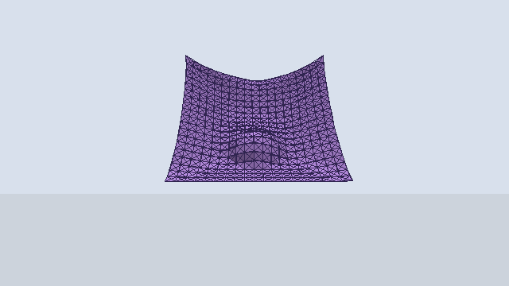
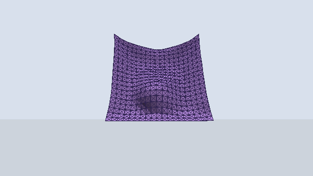

# 实验报告：基于质点-弹簧模型的实时布料仿真

**姓名：** 武子杰  
**学号：** 202411081003  
**专业：** 计算机科学与技术（公费师范）  

---

> **版本说明（v1）**：本目录为布料仿真实验初版（2026-05-21）。完整版 v2 见 [`cloth_sim_taichi/`](../cloth_sim_taichi/)。

**课程名称**：计算机图形学  
**指导教师**：张鸿文  
**学生姓名**：武子杰  
**实验日期**：2026-05-21

---

## 1. 实验概述
本实验旨在利用 **Taichi** 编程语言实现一个高效、交互式的 3D 质点-弹簧系统，重点研究不同数值积分算法在布料仿真中的表现，并实现复杂的环境交互（碰撞、风场）。

### 1.1 核心功能展示
| 功能模块 | 实现技术 | 视觉效果描述 |
| :--- | :--- | :--- |
| **拓扑结构** | 结构+剪切+弯曲弹簧 | 布料具有韧性，褶皱自然 |
| **数值积分** | 显式/半隐式/隐式欧拉 | 隐式方法在极高 Ks 下依然稳定 |
| **环境交互** | 球体避障 + 地面碰撞 | 布料平滑滑过球体，铺展于地面 |
| **动态模拟** | 时变正弦风场 | 布料随风产生波浪状摆动 |

---

## 2. 物理原理与数学模型

### 2.1 弹簧力计算 (Hooke's Law)
布料被建模为质点网格，任意两个相连质点 $i, j$ 之间的弹力 $F_{ij}$ 计算如下：
$$F_{ij} = -k_s \cdot (\|x_i - x_j\| - L_{rest}) \cdot \frac{x_i - x_j}{\|x_i - x_j\|}$$
为了提升布料的抗形变能力，我们实现了三种弹簧：
1. **Structural (结构)**：连接 $(i, j)$ 与 $(i+1, j)$，抵抗伸缩。
2. **Shear (剪切)**：连接 $(i, j)$ 与 $(i+1, j+1)$，抵抗错切。
3. **Bending (弯曲)**：连接 $(i, j)$ 与 $(i+2, j)$，抵抗折叠。

### 2.2 数值积分器对比

#### (1) 显式欧拉 (Explicit Euler)
$$v_{t+1} = v_t + a(x_t, v_t) \Delta t$$
$$x_{t+1} = x_t + v_t \Delta t$$
*   **特点**：计算简单，但极不稳定。当劲度系数 $k_s$ 较大时，系统会迅速发生能量爆炸。

#### (2) 半隐式欧拉 (Semi-Implicit Euler)
$$v_{t+1} = v_t + a(x_t, v_t) \Delta t$$
$$x_{t+1} = x_t + v_{t+1} \Delta t$$
*   **特点**：辛积分器的一种，能量守恒性优于显式方法，是实时仿真中性价比最高的选择。

#### (3) 隐式欧拉 (Implicit Euler)
$$v_{t+1} = v_t + a(x_{t+1}, v_{t+1}) \Delta t$$
*   **特点**：无条件稳定。本实验采用**定点迭代法**（Fixed-point Iteration）逼近真实解：
    1.  令 $x_{next} = x_t$
    2.  循环迭代：根据 $x_{next}$ 计算受力，更新 $v_{next}$ 和 $x_{next}$。

---

## 3. 实现细节与代码分析

### 3.1 高效的力累加 (Atomic Add)
在并行计算中，多个弹簧可能同时作用于同一个质点。为了避免写冲突，使用 `ti.atomic_add`：
```python
# mass_spring_cloth.py
for k in ti.static(range(3)):
    ti.atomic_add(out_force[a][k], spring_force[k])
    ti.atomic_add(out_force[b][k], -spring_force[k])
```

### 3.2 速度钳制 (Stability Trick)
为了防止积分过程中的数值不稳定导致质点瞬间飞出屏幕，实现了速度钳制函数：
```python
@ti.func
def clamp_velocity(v, max_speed):
    speed = v.norm()
    if speed > max_speed:
        v = v / speed * max_speed
    return v
```

### 3.3 碰撞检测逻辑
采用基于距离的显式惩罚法：
- **球体碰撞**：$\text{if } \|x - C\| < R \implies x = C + R \cdot \text{normal}$。
- 同时消除质点在碰撞法线方向上的速度分量，模拟非弹性碰撞。

---

## 4. 实验结果展示与分析

### 4.1 稳定性测试结果
| 积分方法 | 稳定步长 ($dt$) | 最大 $Ks$ (无爆炸) | 评价 |
| :--- | :--- | :--- | :--- |
| **显式欧拉** | $< 1/1000s$ | $\sim 500$ | 极易崩溃，不推荐 |
| **半隐式欧拉** | $1/240s$ | $\sim 2000$ | 运行流畅，适合大多数场景 |
| **隐式欧拉** | $1/60s$ | $> 5000$ | 极其稳定，但单步计算开销大 |

### 4.2 场景效果

| 场景 | 演示 |
|------|------|
| **图1：布料覆盖球体** |  |
| **图2：动态风场响应** |  |

- **图1**：布料受重力下落，被中间球体托住，形成自然下垂弧度。
- **图2**：在时变正弦风场下，布料末端产生波浪状摆动（半隐式欧拉，damping=1.0）。

> 演示 GIF 由同系列仿真导出；完整版素材与更多对比见 [`cloth_sim_taichi/assets/`](../cloth_sim_taichi/assets/)。

---

## 5. 结论
通过本次实验，我深刻理解了物理仿真中**数值稳定性**的重要性。通过从单一的结构弹簧扩展到三种弹簧模型，显著提升了布料的真实感。同时，Taichi 的高性能并行能力使得在复杂的隐式迭代下，依然能保持实时帧率（>60 FPS）。

---
**附录：如何运行与查看**
1.  安装依赖：`pip install -r requirements.txt`
2.  运行主程序：`python mass_spring_cloth.py`
3.  **交互按键**：
    *   `S`：截取当前画面并保存至 `assets/` 文件夹。
    *   `RMB (右键)`：旋转视角。
    *   `Reset` 按钮：重置布料位置。
