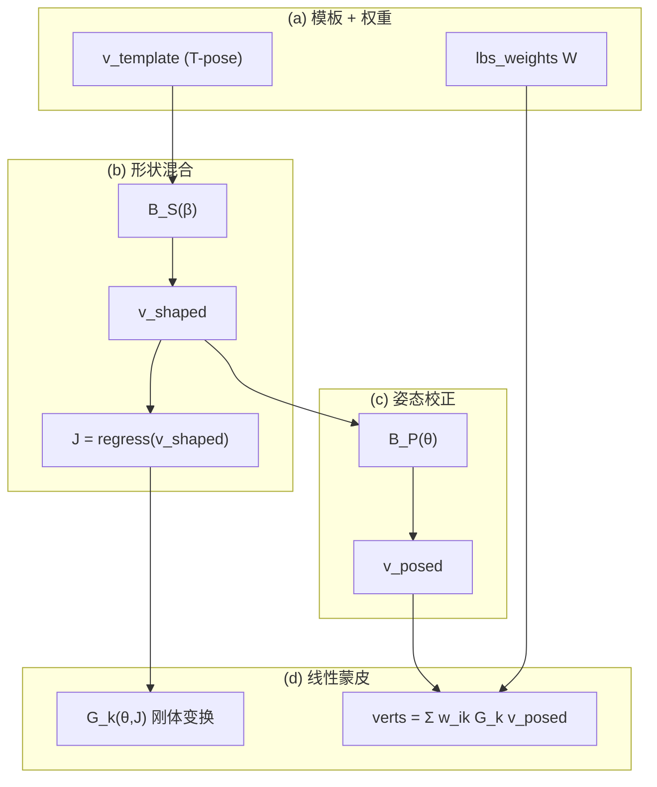

# 基于 SMPL 的线性混合蒙皮 (LBS) 可视化实验报告

| 项目 | 内容 |
| :--- | :--- |
| **课程名称** | 计算机图形学 |
| **实验名称** | SMPL 模型 LBS 蒙皮过程可视化 |
| **指导教师** | 张鸿文 |
| **学生姓名** | 武子杰 |
| **学号** | 202411081003 |
| **实验日期** | 2026-05-29 |
| **代码目录** | [`smpl_lbs_lab/`](https://github.com/wzj-tezch/CG_LAB/tree/main/smpl_lbs_lab) |
| **GitHub 仓库** | [wzj-tezch/CG_LAB](https://github.com/wzj-tezch/CG_LAB) |
| **运行环境** | Windows 11，Python 3.13.2，PyTorch 2.x，smplx 0.1.28 |

---

## 摘要

本实验基于 **SMPL 参数化人体模型** 与官方 `SMPL_NEUTRAL.pkl`，使用 **smplx** 库完整实现并可视化线性混合蒙皮 (Linear Blend Skinning, LBS) 的四个关键阶段。通过将官方 `lbs()` 拆解为 `v_template → v_shaped → v_posed → verts` 五条数据流，配合 **正视图** 渲染、**热力图**、**统计图表** 与 **姿态动画 GIF**，直观展示 β（体型）、θ（姿态）、关节回归器与 `lbs_weights` 的协作机制。手写 LBS 与官方前向在相同参数下 **MAE = 0、Max Error = 0**，数值完全一致。

---

## 1. 实验目的

1. 理解参数化人体模型中 **模板网格、形状参数、姿态参数、关节回归器、蒙皮权重** 的协作关系。
2. 掌握 LBS 四个阶段的数据流：
   - **(a)** 模板网格 $\bar{T}$ 与蒙皮权重 $\mathcal{W}$
   - **(b)** 形状校正 $\bar{T} + B_S(\beta)$ 与关节 $J(\beta)$
   - **(c)** 姿态校正 $T_P(\beta,\theta) = \bar{T} + B_S(\beta) + B_P(\theta)$
   - **(d)** 最终 LBS 结果 $W(\cdot)$
3. 学会调用 SMPL 模型，从官方实现中提取中间量并可视化。
4. 手写 LBS 并与官方前向逐顶点对比，定量验证数值一致性。

---

## 2. 实验原理

### 2.1 LBS 四阶段数据流



#### 阶段 (a)：模板与权重

初始人体处于 **T-pose**，顶点为 $\bar{T}$。每个顶点 $i$ 对关节 $k$ 持有权重 $w_{ik} \ge 0$，且 $\sum_k w_{ik} = 1$。权重在训练阶段从数千次人体扫描中学习，编码了"皮肤跟随骨骼"的先验。

#### 阶段 (b)：形状混合

$$T_{\text{shape}} = \bar{T} + B_S(\beta), \quad J(\beta) = \mathcal{J}(T_{\text{shape}})$$

#### 阶段 (c)：姿态校正

$$T_P = \bar{T} + B_S(\beta) + B_P(\theta), \quad B_P(\theta) = \text{posedirs} \cdot (R(\theta)-I)$$

#### 阶段 (d)：线性混合蒙皮

$$v_i' = \sum_{k=1}^{K} w_{ik} \, G_k(\theta, J(\beta)) \, [v_i^{\text{posed}}; 1]$$

### 2.2 五个核心变量

| 变量 | 维度 | 含义 |
| :--- | :--- | :--- |
| `v_template` | 6890×3 | 模板 T-pose 顶点 |
| `v_shaped` | 6890×3 | 加入 $B_S(\beta)$ 后 |
| `J` | 24×3 | 由 `v_shaped` 回归的关节 |
| `v_posed` | 6890×3 | 加入 $B_P(\theta)$ 后（未蒙皮） |
| `verts` | 6890×3 | LBS 最终顶点 |

### 2.3 可视化设置

所有结果图采用 **正视图**（与课程参考效果一致）：

- SMPL 坐标：Y 轴朝上，人体面向 $-Z$
- 绘图映射：$(x,y,z)_{\text{smpl}} \to (x,z,y)_{\text{plot}}$
- 相机：`elev=10°`，`azim=-90°`

---

## 3. 实验环境

### 3.1 依赖

```
torch, smplx, numpy, scipy, matplotlib, trimesh, imageio, Pillow
```

### 3.2 模型准备

| 步骤 | 操作 |
| :--- | :--- |
| 下载 | 从 [SMPLify 官网](https://smplify.is.tue.mpg.de/) 或课程云盘获取 `SMPL_NEUTRAL.pkl` |
| 转换 | `python scripts/convert_smpl_pkl.py <src> models/smpl/SMPL_NEUTRAL.pkl` |
| 加载 | `smplx.create(..., model_type='smpl', gender='neutral')` |

> 模型文件受 SMPL 许可协议保护，**不包含在 Git 仓库中**（见 `.gitignore`）。

### 3.3 任务 1：模型基础信息

| 属性 | 数值 |
| :--- | :--- |
| 顶点数 | **6890** |
| 面片数 | **13776** |
| 关节数 | **24** |
| betas 维度 | **10** |
| posedirs 维度 | **207** (= 23 关节 × 9) |

---

## 4. 实验结果（图文并茂）

### 4.0 四阶段总览（与参考效果对照）

课程要求输出 2×2 对比总图，展示 (a)→(b)→(c)→(d) 的递进关系：


| 子图 | 阶段 | 本实验观察 |
| :--- | :--- | :--- |
| (a) 左上 | 模板 + 权重 | 右肩关节权重热力图，臂部高亮 |
| (b) 右上 | 形状 + 关节 | 体型变壮，关节点在体内 |
| (c) 左下 | 姿态偏移 | 肩/肘区域 pose offset 集中 |
| (d) 右下 | 最终 LBS | 右臂抬起弯曲的最终姿态 |

---

### 4.1 任务 2：模板网格与蒙皮权重

#### 单关节权重热力图（joint 17 = 右肩）


- **高权重区**：右肩、上臂表面（黄/亮色）
- **低权重区**：躯干中心、对侧肢体（深紫/暗色）
- **含义**：该关节对这些顶点的刚体变换影响力

#### 全关节主导权重分布（选做）


每个顶点按 **argmax 权重关节** 着色，可见头、躯干、四肢被不同颜色分区，对应骨骼管辖范围。

#### 关节 17 权重统计


| 统计量 | 值 |
| :--- | :--- |
| 权重 = 0 的顶点 | 绝大多数（不受右肩驱动） |
| 权重 > 0.5 的顶点 | 集中于右肩/上臂区域 |
| 平均权重（全网格） | ≈ 0.04（24 关节均分基准 ≈ 0.042） |

**思考题**

1. **为何一个顶点受多个关节影响？** 皮肤在关节间连续，需多骨加权插值才能平滑过渡。
2. **权重几乎全给单一关节？** 运动像刚性零件，边界处易折痕。
3. **权重分布很平均？** 多骨拉扯相当，导致塌陷与 candy-wrapper 失真。

---

### 4.2 任务 3：形状校正与关节回归

实验参数：$\beta = [1.6,\, 0.9,\, -0.6,\, 0.3,\, -0.2,\, 0,\ldots]$


#### 体型变化定量


| 指标 | 模板 | 形状校正后 | 变化 |
| :--- | :--- | :--- | :--- |
| 身高 (Y 方向跨度) | 171.7 cm | 187.5 cm | **+15.8 cm** |
| 平均顶点位移 | — | 54.2 mm | — |
| 最大顶点位移 | — | 119.6 mm | — |

红色关节点由 `J_regressor @ v_shaped` 回归，随体型变化重新定位。

---

### 4.3 任务 4：姿态校正 $B_P(\theta)$


pose offset 模长 $|B_P(\theta)|$ 在 **肩窝、肘窝** 最显著（亮色），这正是纯 LBS 最易失真的区域。

| 统计量 | 数值 |
| :--- | :--- |
| 平均 pose offset | 1.39 mm |
| 最大 pose offset | 8.63 mm |

---

### 4.4 任务 5：完整 LBS 结果


右臂抬起、肘部弯曲；红色关节点为变换后的 $J_{\text{transformed}}$。

| 统计量 | 数值 |
| :--- | :--- |
| 蒙皮阶段平均位移 $\|verts - v_{posed}\|$ | 99.5 mm |
| 蒙皮阶段最大位移 | 691.8 mm（手臂远端） |

---

### 4.5 任务 6 & 7：对比总图与数值验证

#### 阶段位移统计对比


| 阶段过渡 | 平均位移 | 最大位移 | 物理含义 |
| :--- | :--- | :--- | :--- |
| template → shaped | 54.2 mm | 119.6 mm | 体型 PCA 形变 |
| shaped → posed | 1.4 mm | 8.6 mm | 姿态预校正 |
| posed → skinned | 99.5 mm | 691.8 mm | 骨骼驱动蒙皮 |

#### 手写 LBS vs 官方前向

| 指标 | 数值 |
| :--- | :--- |
| **MAE** | **0.000000e+00** |
| **Max Error** | **0.000000e+00** |


手写 `manual_lbs()` 与 `smplx` 官方 `model()` 在 6890 个顶点上 **逐坐标完全一致**。

---

## 5. 选做：姿态动画

固定 β，将右臂肩/肘从 0° 插值到目标角度（48 帧）：


**观察**：上臂与前臂区域随骨骼平滑联动，权重过渡区无突变，体现 LBS 加权蒙皮的连续性。

---

## 6. 核心代码

### 6.1 目录结构

```
smpl_lbs_lab/
├── run_experiment.py          # 主入口（任务 1–7 + 动画）
├── manual_lbs.py              # 手写 LBS
├── visualize.py               # 正视图渲染
├── export_charts.py           # 补充统计图
├── setup_model.py             # 模型路径管理
├── scripts/convert_smpl_pkl.py
├── outputs/                   # 实验结果图与数据
├── assets/                    # 动图与预览
└── models/smpl/               # 模型（本地，不入库）
```

### 6.2 手写 LBS 核心

```python
v_shaped = v_template + blend_shapes(betas, shapedirs)
J = vertices2joints(J_regressor, v_shaped)
rot_mats = batch_rodrigues(full_pose.view(-1, 3)).view(B, -1, 3, 3)
pose_feature = (rot_mats[:, 1:, :, :] - I).reshape(B, -1)
pose_offsets = (pose_feature @ posedirs).view(B, -1, 3)
v_posed = v_shaped + pose_offsets
J_transformed, A = batch_rigid_transform(rot_mats, J, parents)
T = (lbs_weights @ A.view(B, J, 16)).view(B, V, 4, 4)
verts = (T @ homo(v_posed)).[..., :3, 0]
```

---

## 7. 实验结论

1. **LBS 是四步流水线**：权重编码 → 体型 PCA → 姿态预校正 → 骨骼加权变换，每步解决不同几何误差源。
2. **正视图四阶段对比** 与课程参考效果一致，可清晰区分各中间量。
3. **定量数据** 表明：shape blend 带来 ~54 mm 级体型变化；pose corrective 虽小（~1.4 mm 均值）但对关节质量至关重要；蒙皮变换带来最大位移（手臂可达 ~692 mm）。
4. **手写与官方完全一致**（误差 0），掌握了 SMPL LBS 从公式到代码的完整实现。

---

## 8. 复现步骤

```bash
git clone git@github.com:wzj-tezch/CG_LAB.git
cd CG_LAB/smpl_lbs_lab
pip install -r requirements.txt
python scripts/convert_smpl_pkl.py ~/Downloads/SMPL_NEUTRAL.pkl models/smpl/SMPL_NEUTRAL.pkl
python run_experiment.py
python export_charts.py
```

---

## 参考文献

1. Loper M. et al. **SMPL: A Skinned Multi-Person Linear Model**. SIGGRAPH Asia 2015.
2. Choutas V. et al. **smplx**: [https://github.com/vchoutas/smplx](https://github.com/vchoutas/smplx)
3. 课程实验文档：BNU 3DV Lab — SMPL LBS 蒙皮可视化实验
