# 基于 SMPL 的线性混合蒙皮 (LBS) 可视化实验报告

<p align="center">
  
</p>

<p align="center">
  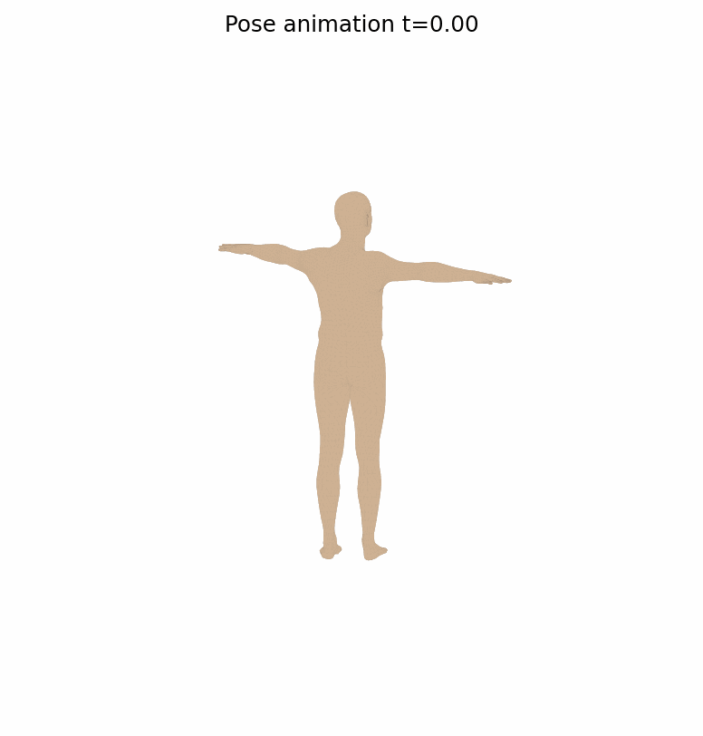
  <br>
  <sub>选做：右臂肩/肘插值动画（正视图，48 帧）</sub>
</p>

| 项目 | 内容 |
| :--- | :--- |
| **课程名称** | 计算机图形学 |
| **实验名称** | SMPL 模型 LBS 蒙皮过程可视化 |
| **指导教师** | 张鸿文 |
| **学生姓名** | 武子杰 |
| **学号** | 202411081003 |
| **实验日期** | 2026-05-29 |
| **GitHub** | [wzj-tezch/CG_LAB](https://github.com/wzj-tezch/CG_LAB/tree/main/smpl_lbs_lab) |
| **运行环境** | Windows 11 · Python 3.13.2 · PyTorch 2.x · smplx 0.1.28 |

---

## 目录

- [摘要](#摘要)
- [1. 实验目的](#1-实验目的)
- [2. 实验原理](#2-实验原理)
- [3. 实验环境](#3-实验环境)
- [4. 实验结果](#4-实验结果)
- [5. 选做：姿态动画](#5-选做姿态动画)
- [6. 核心代码](#6-核心代码)
- [7. 实验结论](#7-实验结论)
- [8. 复现步骤](#8-复现步骤)
- [参考文献](#参考文献)

---

## 摘要

> 本实验基于 **SMPL 参数化人体模型** 与官方 `SMPL_NEUTRAL.pkl`，使用 **smplx** 库完整实现并可视化 **线性混合蒙皮 (Linear Blend Skinning, LBS)** 的四个关键阶段。将官方 `lbs()` 拆解为 `v_template → v_shaped → v_posed → verts` 五条数据流，配合 **正视图** 渲染、**热力图**、**统计图表** 与 **姿态动画 GIF**，展示体型参数 $\beta$、姿态参数 $\theta$、关节回归器与 `lbs_weights` 的协作机制。手写 LBS 与官方前向在相同参数下 **MAE = 0、Max Error = 0**，数值完全一致。

---

## 1. 实验目的

1. 理解 **模板网格、形状参数、姿态参数、关节回归器、蒙皮权重** 之间的关系。
2. 掌握 LBS 四阶段数据流：
   - **(a)** 模板网格 $\bar{T}$ 与蒙皮权重 $\mathcal{W}$
   - **(b)** 形状校正 $\bar{T} + B_S(\beta)$ 与关节 $J(\beta)$
   - **(c)** 姿态校正 $T_P(\beta,\theta) = \bar{T} + B_S(\beta) + B_P(\theta)$
   - **(d)** 最终 LBS 结果 $W(\cdot)$
3. 调用 SMPL 模型，从官方实现中提取中间量并可视化。
4. 手写 LBS 并与官方前向逐顶点对比，定量验证一致性。

---

## 2. 实验原理

### 2.1 LBS 四阶段数据流


| 阶段 | 公式 | 代码关键量 |
| :---: | :--- | :--- |
| **(a)** 模板与权重 | 顶点 $\bar{T}$，权重 $w_{ik}$，$\sum_k w_{ik}=1$ | `v_template`, `lbs_weights` |
| **(b)** 形状混合 | $T_{\mathrm{shape}} = \bar{T} + B_S(\beta)$ | `v_shaped`, `shapedirs` |
| **(c)** 关节回归 | $J(\beta) = \mathcal{J}(T_{\mathrm{shape}})$ | `J_regressor`, `J` |
| **(c)** 姿态校正 | $T_P = \bar{T} + B_S(\beta) + B_P(\theta)$ | `v_posed`, `posedirs` |
| **(d)** 线性蒙皮 | 见下方公式 | `verts`, `J_transformed` |

**阶段 (a)**：人体处于 T-pose，每个顶点 $i$ 对关节 $k$ 持有非负权重 $w_{ik}$，决定其将来跟随哪些骨骼运动。

**阶段 (b)** 形状混合：

$$
T_{\mathrm{shape}} = \bar{T} + B_S(\beta)
$$

**阶段 (b)** 关节回归：

$$
J(\beta) = \mathcal{J}(T_{\mathrm{shape}})
$$

**阶段 (c)** 姿态校正（pose blend shape）：

$$
T_P(\beta,\theta) = \bar{T} + B_S(\beta) + B_P(\theta)
$$

其中 $B_P(\theta)$ 由旋转矩阵特征 $(R(\theta) - I)$ 经 `posedirs` 线性映射得到。

**阶段 (d)** 线性混合蒙皮：

$$
v_i' = \sum_{k=1}^{K} w_{ik} \, G_k(\theta, J(\beta)) \begin{bmatrix} v_i^{\mathrm{posed}} \\ 1 \end{bmatrix}
$$

### 2.2 五个核心变量

| 变量 | 维度 | 含义 |
| :--- | :--- | :--- |
| `v_template` | $6890 \times 3$ | 模板 T-pose 顶点 |
| `v_shaped` | $6890 \times 3$ | 加入 $B_S(\beta)$ 后 |
| `J` | $24 \times 3$ | 由 `v_shaped` 回归的关节 |
| `v_posed` | $6890 \times 3$ | 加入 $B_P(\theta)$ 后（尚未蒙皮） |
| `verts` | $6890 \times 3$ | LBS 最终顶点 |

### 2.3 可视化设置

所有结果图采用 **正视图**（与课程参考效果一致）：

| 设置项 | 值 |
| :--- | :--- |
| SMPL 坐标系 | Y 轴朝上，人体面向 $-Z$ |
| 绘图坐标映射 | $(x,y,z)_{\mathrm{smpl}} \rightarrow (x,z,y)_{\mathrm{plot}}$ |
| 相机参数 | `elev = 10°`，`azim = -90°` |

---

## 3. 实验环境

### 3.1 依赖

```text
torch, smplx, numpy, scipy, matplotlib, trimesh, imageio, Pillow
```

### 3.2 模型准备

| 步骤 | 命令 / 说明 |
| :--- | :--- |
| ① 下载 | [SMPLify 官网](https://smplify.is.tue.mpg.de/) 或课程云盘获取 `SMPL_NEUTRAL.pkl` |
| ② 转换 | `python scripts/convert_smpl_pkl.py <src> models/smpl/SMPL_NEUTRAL.pkl` |
| ③ 运行 | `python run_experiment.py` |

> **注意**：`models/smpl/*.pkl` 受 SMPL 许可协议保护，**不包含在 Git 仓库中**。

### 3.3 任务 1：模型基础信息

| 属性 | 数值 |
| :--- | :--- |
| 顶点数 | **6890** |
| 面片数 | **13776** |
| 关节数 | **24** |
| betas 维度 | **10** |
| posedirs 维度 | **207**（$23 \times 9$） |

---

## 4. 实验结果

### 4.0 四阶段总览

<p align="center">
  
</p>

| 子图 | 阶段 | 观察 |
| :---: | :--- | :--- |
| **(a)** 左上 | 模板 + 权重 | 右肩权重热力图，臂部高亮 |
| **(b)** 右上 | 形状 + 关节 | 体型变壮，关节在体内 |
| **(c)** 左下 | 姿态偏移 | 肩/肘 pose offset 集中 |
| **(d)** 右下 | 最终 LBS | 右臂抬起弯曲 |

---

### 4.1 任务 2：模板网格与蒙皮权重

<p align="center">
  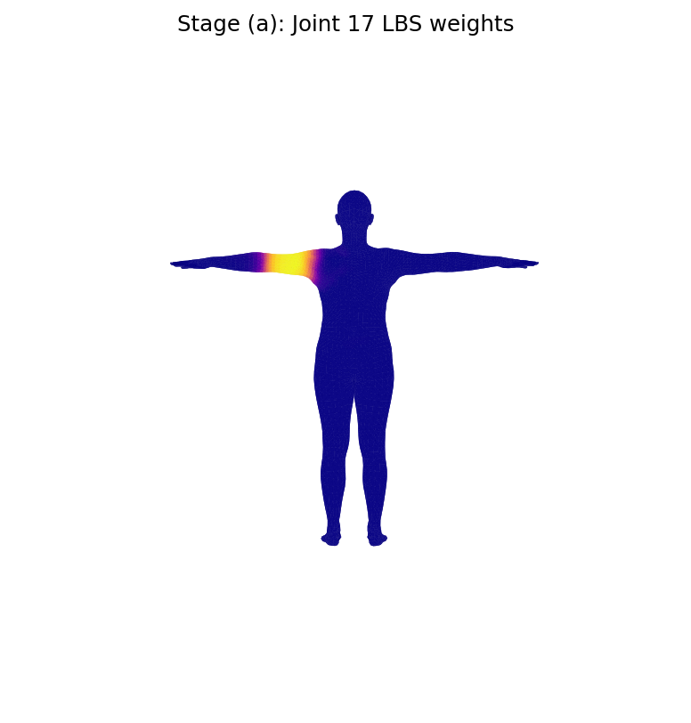
  &nbsp;&nbsp;
  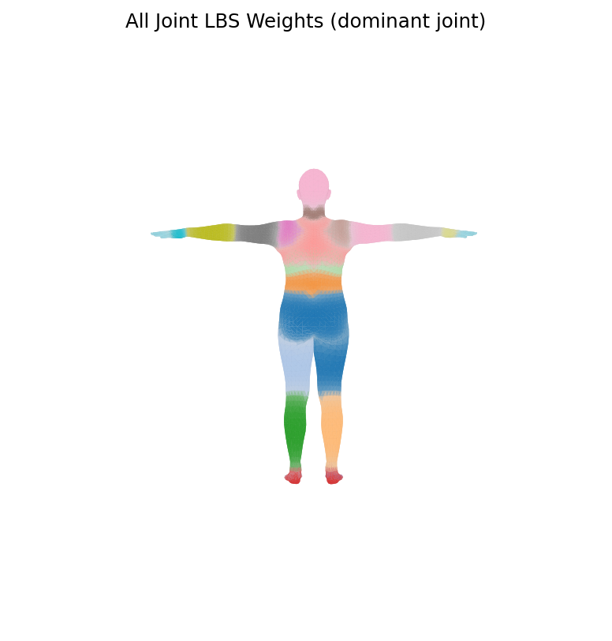
</p>

<p align="center">
  <sub>左：单关节权重（joint 17 右肩）　　右：全关节主导权重分布</sub>
</p>

<p align="center">
  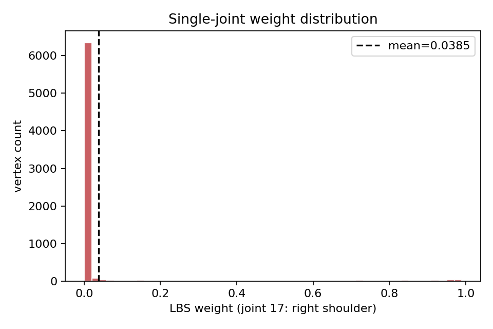
</p>

<details>
<summary><b>思考题</b></summary>

1. **为何一个顶点受多个关节影响？** 皮肤跨关节连续，需多骨加权插值才能平滑过渡。
2. **权重几乎全给单一关节？** 运动像刚性零件，边界处易产生折痕。
3. **权重分布很平均？** 多骨拉扯相当，导致体积塌陷与 candy-wrapper 失真。

</details>

---

### 4.2 任务 3：形状校正与关节回归

实验参数：

$$
\beta = [1.6,\; 0.9,\; -0.6,\; 0.3,\; -0.2,\; 0,\; \ldots]
$$

<p align="center">
  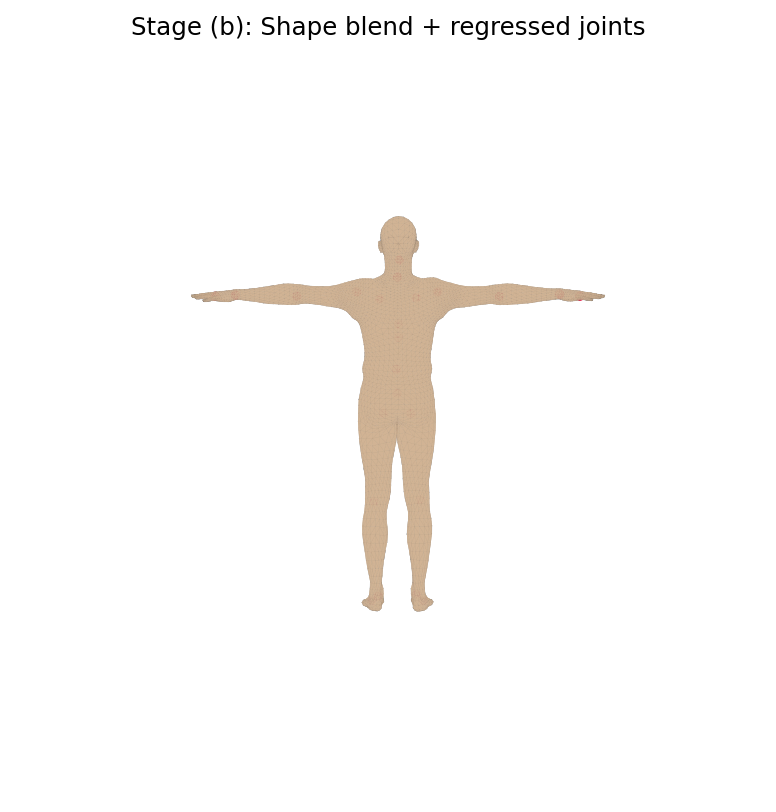
  &nbsp;&nbsp;
  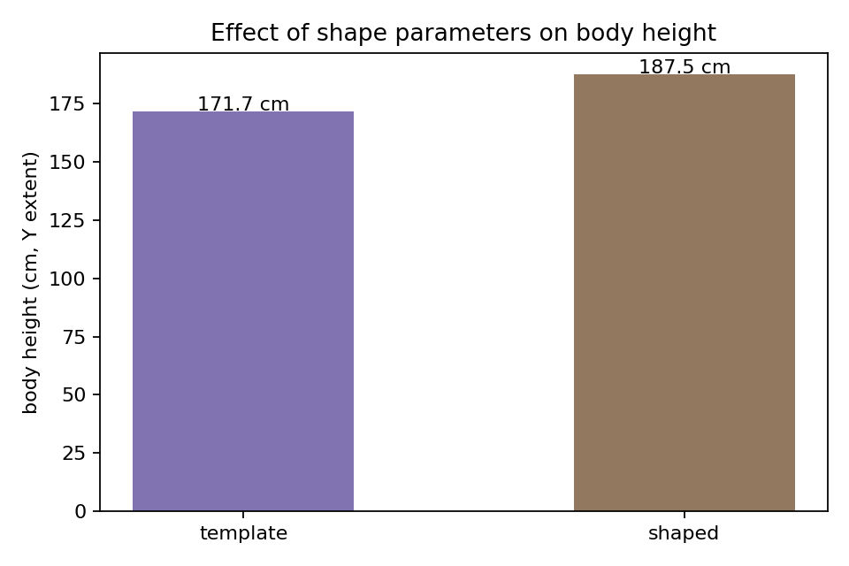
</p>

| 指标 | 模板 | 形状校正后 | 变化 |
| :--- | :--- | :--- | :--- |
| 身高（Y 方向跨度） | 171.7 cm | 187.5 cm | **+15.8 cm** |
| 平均顶点位移 | — | 54.2 mm | — |
| 最大顶点位移 | — | 119.6 mm | — |

---

### 4.3 任务 4：姿态校正 $B_P(\theta)$

<p align="center">
  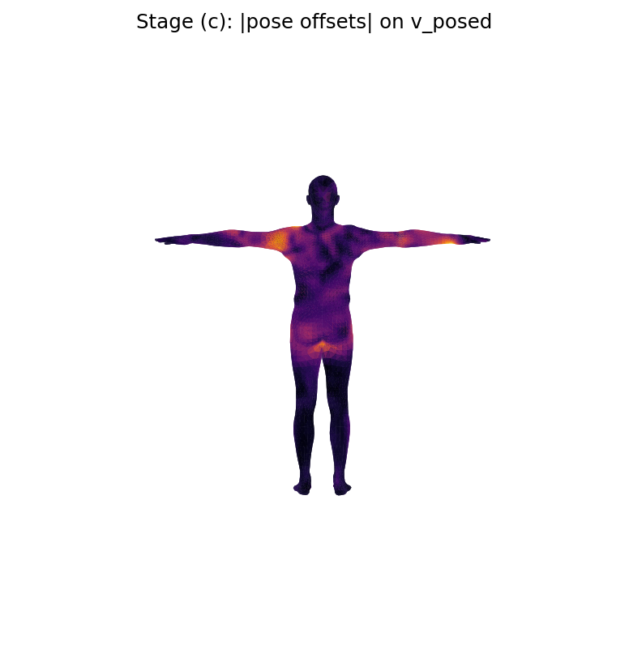
</p>

pose offset 模长 $\lVert B_P(\theta) \rVert$ 在 **肩窝、肘窝** 最显著。

| 统计量 | 数值 |
| :--- | :--- |
| 平均 pose offset | 1.39 mm |
| 最大 pose offset | 8.63 mm |

---

### 4.4 任务 5：完整 LBS 结果

<p align="center">
  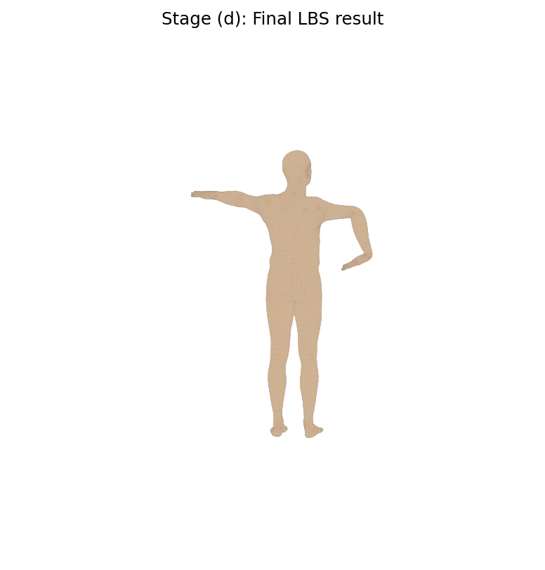
</p>

红色关节点为变换后的 $J_{\mathrm{transformed}}$。

| 统计量 | 数值 |
| :--- | :--- |
| 蒙皮平均位移（verts 与 v_posed 之间） | 99.5 mm |
| 蒙皮最大位移 | 691.8 mm（手臂远端） |

---

### 4.5 任务 6 & 7：统计图表与数值验证

<p align="center">
  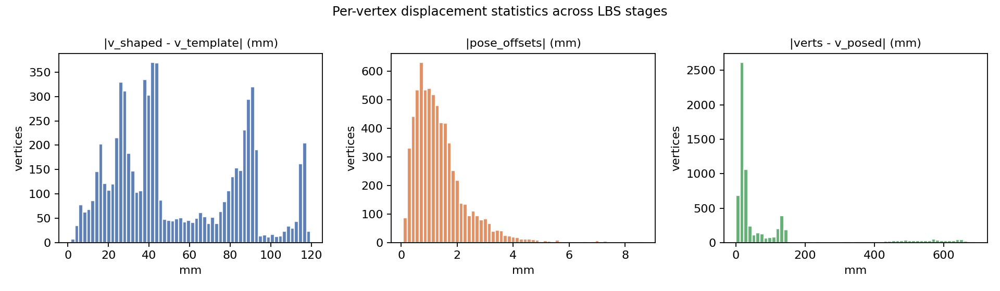
</p>

<p align="center">
  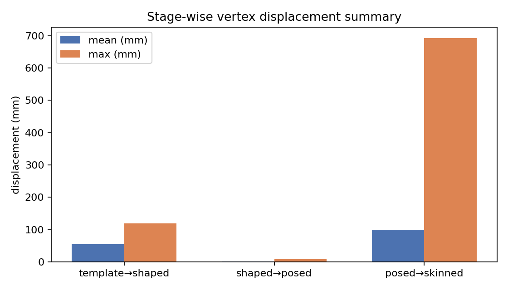
  &nbsp;&nbsp;
  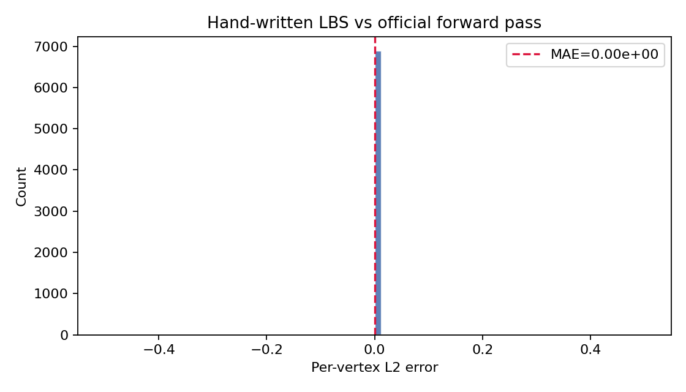
</p>

| 阶段过渡 | 平均位移 | 最大位移 | 物理含义 |
| :--- | :--- | :--- | :--- |
| template → shaped | 54.2 mm | 119.6 mm | 体型 PCA 形变 |
| shaped → posed | 1.4 mm | 8.6 mm | 姿态预校正 |
| posed → skinned | 99.5 mm | 691.8 mm | 骨骼驱动蒙皮 |

**手写 LBS vs 官方 smplx 前向**

| 指标 | 数值 |
| :--- | :--- |
| 平均绝对误差 MAE | **0.000000e+00** |
| 最大绝对误差 Max | **0.000000e+00** |

<p align="center">
  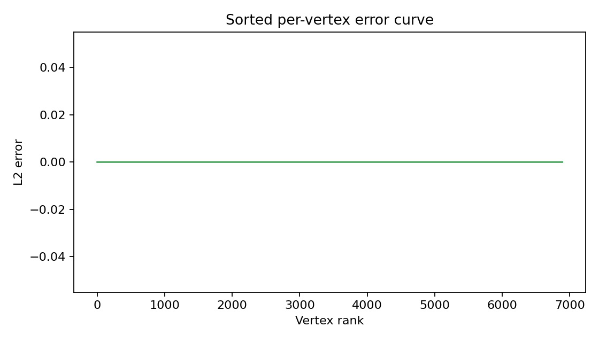
</p>

---

## 5. 选做：姿态动画

<p align="center">
  
</p>

固定 $\beta$，将右臂肩/肘从 $0°$ 插值到目标角度（48 帧）。上臂与前臂随骨骼 **平滑联动**，权重过渡区无突变。

---

## 6. 核心代码

### 6.1 目录结构

```text
smpl_lbs_lab/
├── run_experiment.py           # 主入口（任务 1–7 + 动画）
├── manual_lbs.py               # 手写 LBS
├── visualize.py                # 正视图渲染
├── export_charts.py            # 补充统计图
├── setup_model.py              # 模型路径管理
├── scripts/convert_smpl_pkl.py # chumpy → numpy 转换
├── outputs/                    # 实验结果图与数据
├── assets/                     # 动图与预览
└── models/smpl/                # 模型（本地，不入库）
```

### 6.2 手写 LBS 核心

```python
v_shaped = v_template + blend_shapes(betas, shapedirs)
J = vertices2joints(J_regressor, v_shaped)
rot_mats = batch_rodrigues(full_pose.view(-1, 3)).view(B, -1, 3, 3)
pose_feature = (rot_mats[:, 1:, :, :] - I).reshape(B, -1)
pose_offsets = (pose_feature @ posedirs).view(B, -1, 3)
v_posed = v_shaped + pose_offsets
J_transformed, A = batch_rigid_transform(rot_mats, J, parents)
T = (lbs_weights @ A.view(B, J, 16)).view(B, V, 4, 4)
verts = (T @ homo(v_posed))[..., :3, 0]
```

---

## 7. 实验结论

1. **LBS 是四步流水线**：权重编码 → 体型 PCA → 姿态预校正 → 骨骼加权变换。
2. **正视图四阶段对比** 与课程参考效果一致，各中间量可清晰区分。
3. **定量数据**：shape blend ~54 mm；pose corrective ~1.4 mm（均值）但至关重要；蒙皮位移最大 ~692 mm。
4. **手写与官方完全一致**（误差为 0），掌握 SMPL LBS 从公式到代码的完整映射。

---

## 8. 复现步骤

```bash
git clone git@github.com:wzj-tezch/CG_LAB.git
cd CG_LAB/smpl_lbs_lab
pip install -r requirements.txt
python scripts/convert_smpl_pkl.py ~/Downloads/SMPL_NEUTRAL.pkl models/smpl/SMPL_NEUTRAL.pkl
python run_experiment.py
python export_charts.py
```

---

## 参考文献

1. Loper M. et al. **SMPL: A Skinned Multi-Person Linear Model**. SIGGRAPH Asia 2015.
2. Choutas V. et al. **smplx**: <https://github.com/vchoutas/smplx>
3. BNU 3DV Lab — SMPL LBS 蒙皮可视化实验

---

<p align="center">
  <sub>武子杰 · 202411081003 · 计算机图形学 · 2026-05-29</sub>
</p>
