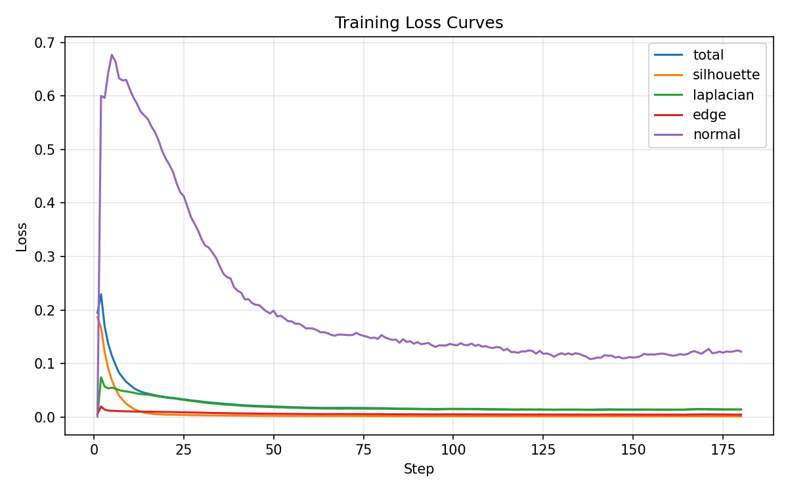
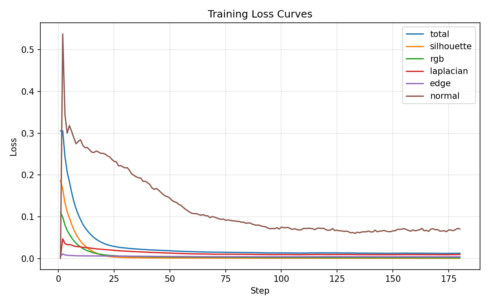

# 实验报告：PyTorch3D 可微渲染网格重建（Work1）

## 1. 实验目标

本实验围绕“可微渲染 + 网格优化”展开，目标如下：

1. 理解并掌握可微光栅化在离散网格边界上的梯度近似思想。  
2. 学会使用多视角二维监督（Silhouette / RGB）优化三维网格顶点。  
3. 通过正则化约束避免网格崩坏，提升优化稳定性与几何合理性。  
4. 在必做任务基础上完成选做任务：联合 RGB 监督进行形状 + 外观优化。  

---

## 2. 实验原理

### 2.1 软光栅化（解决边界梯度消失）

传统硬光栅化中，像素覆盖是 0/1 跳变，边界不可导，导致顶点在很多位置无法收到有效梯度。  
本实验使用软近似，将像素归属视为连续概率：

$$
A(d)=\sigma\left(\frac{d}{\sigma_r}\right)
$$

- $d$：像素到三角形边界的符号距离  
- $\sigma_r$：边界平滑系数（代码里对应 `sigma`）  

这样顶点即便在像素边界外，也能接收小但非零的梯度信号。

### 2.2 网格正则化（抑制局部最优与拓扑崩坏）

仅依赖图像误差优化会导致网格出现尖刺、边长异常、面翻折等问题。  
因此在损失中加入三项几何正则：

- 拉普拉斯平滑 `L_lap`（抑制局部高频噪声）
- 边长约束 `L_edge`（约束网格拉伸）
- 法线一致性 `L_normal`（提升面片连续性）

必做总损失：

$$
L_{sil\_total}=L_{silhouette}+w_{lap}L_{lap}+w_{edge}L_{edge}+w_{normal}L_{normal}
$$

选做总损失：

$$
L_{tex\_total}=L_{silhouette}+w_{rgb}L_{rgb}+w_{lap}L_{lap}+w_{edge}L_{edge}+w_{normal}L_{normal}
$$

---

## 3. 实现说明

### 3.1 代码结构

- `src/Work1/config.py`：实验超参数（分辨率、视角数、迭代步数、学习率、损失权重）
- `src/Work1/data.py`：目标奶牛网格下载、加载、归一化；多视角相机构造
- `src/Work1/renderers.py`：`SoftSilhouette` 与 `SoftPhong` 渲染器构建
- `src/Work1/losses.py`：损失组装（silhouette/rgb + lap/edge/normal）
- `src/Work1/train_silhouette.py`：必做训练循环（球体 -> 奶牛轮廓）
- `src/Work1/train_textured.py`：选做训练循环（顶点位移 + 顶点颜色联合优化）
- `src/Work1/visualize.py`：中间结果图、损失曲线、turntable GIF、mesh 导出
- `src/Work1/main.py`：统一命令行入口，支持 `silhouette` / `textured` / `both`
- `work1_environment.yml`：WSL2 + Conda 环境模板

### 3.2 关键实现点

1. **目标监督构建**  
   先渲染 target cow 的多视角 silhouette / RGB 作为监督信号。

2. **源网格初始化**  
   使用高细分 `ico_sphere` 作为可形变源模型，优化变量为 `deform_verts`。

3. **可微优化参数**  
   - 必做：仅优化顶点形变
   - 选做：同时优化顶点形变和顶点颜色（`TexturesVertex`）

4. **可视化与导出**  
   定期保存 `step_xxxx.png`，结束后导出 `.obj`、loss 曲线、turntable 动图。

---

## 4. 环境与运行

目录规范说明：本实验以 `work1_pytorch3d_lab/` 作为唯一正式目录。  
以下命令均默认在 `work1_pytorch3d_lab/` 目录执行。

## 4.1 硬件/系统

- Windows 11 + WSL2 Ubuntu
- GPU：NVIDIA GeForce RTX 4060 Laptop GPU（8GB 显存）

## 4.2 环境配置（实际可用方案）

由于网络与通道稳定性问题，最终采用“Conda + pip 轮子”稳定方案：

1. 创建 Conda 环境（Python 3.10）
2. 安装 `torch==2.2.1+cu121`、`torchvision==0.17.1+cu121`
3. 安装 `pytorch3d==0.7.6`（匹配轮子）
4. 安装 `fvcore`、`iopath`、`matplotlib`、`imageio` 等
5. 将 `numpy` 固定为 `1.26.4`（避免 torch 与 numpy2 的兼容问题）

## 4.3 运行命令

```bash
# 必做
python -m src.Work1.main --mode silhouette --steps 180 --image-size 192 --num-views 16

# 选做
python -m src.Work1.main --mode textured --steps 180 --image-size 192 --num-views 16

# 联合（高质量）
python -m src.Work1.main --mode both --steps 320 --image-size 320 --num-views 32
```

---

## 5. 实验结果

## 5.1 必做结果（Silhouette）

推荐提交目录（已完成）：

- `outputs/work1/silhouette_20260512_183955`

关键产物：

- `meshes/silhouette_final.obj`
- `plots/silhouette_losses.png`
- `images/silhouette_turntable.gif`
- `images/final_rgb_compare.png`

收敛情况（日志）：

- `total loss`：`0.194745 -> 0.014295`
- `silhouette loss`：`0.187011 -> 0.001479`

结论：球体能够稳定变形为奶牛轮廓，正则化有效抑制了几何爆炸。

成果可视化（必做）：




## 5.2 选做结果（Textured / RGB 联合）

推荐提交目录（已完成）：

- `outputs/work1/textured_20260512_183217`

关键产物：

- `meshes/textured_final.obj`
- `meshes/vertex_rgb.pt`
- `plots/textured_losses.png`
- `images/textured_turntable.gif`
- 多组 `images/rgb_step_*.png` 与 `images/silhouette_step_*.png`

收敛情况（日志）：

- `total loss`：`0.305449 -> 0.012874`
- `silhouette loss`：`0.187011 -> 0.000996`
- `rgb loss`：`0.110704 -> 0.001962`

结论：在保持轮廓拟合的同时，颜色外观显著收敛，选做目标达成。

成果可视化（选做）：




## 5.3 高质量加跑结果

- `silhouette_20260512_184303`：已完整结束并产出完整结果
- `textured_20260512_203105`：按需求手动停止，保留中间结果到 `step_0100`

说明：高质量配置计算成本显著提高。本次 `textured_20260512_203105` 为中途手动停止的中间结果（非完整收敛 run），用于展示更高质量参数下的阶段性效果趋势，不作为最终完整产物替代。

高质量中间结果（手动停止前）：


---

## 6. 问题排查与解决记录

1. **`ModuleNotFoundError: pytorch3d`**  
   原因：环境未安装。  
   解决：WSL2 中重新创建环境并安装匹配版本轮子。

2. **Conda HTTP 000 下载失败（网络超时）**  
   原因：通道下载中断。  
   解决：切换到更稳的 Conda+pip 轮子安装路径，并重试。

3. **`RuntimeError: Numpy is not available` / numpy2 兼容问题**  
   原因：部分依赖与 numpy2 不兼容。  
   解决：固定 `numpy==1.26.4`。

4. **`Meshes does not have textures`（Silhouette 收尾可视化）**  
   原因：Phong 渲染阶段网格缺纹理。  
   解决：为收尾可视化网格补 `TexturesVertex`。

---

## 7. 结论与思考

1. 软光栅化使边界可导，是 mesh-from-image 优化可行的关键。  
2. 正则化项不是可选项，而是稳定优化与几何合理性的核心。  
3. 选做中的 RGB 监督显著提升外观一致性，但会引入更高计算成本。  
4. 高分辨率与多视角能提升质量，但应结合硬件预算设置迭代策略。  

---

## 8. 提交清单

- [x] 源代码：`src/Work1/*`
- [x] 环境文件：`work1_environment.yml`
- [x] 必做结果：`silhouette_20260512_183955`（完整）
- [x] 选做结果：`textured_20260512_183217`（完整）
- [x] 高质量补充：`silhouette_20260512_184303` + `textured_20260512_203105`（中间结果）
- [x] 实验报告：本 `README.md`

---

## 附：Work0 兼容运行方式

```bash
uv run -m src.Work0.main
```
